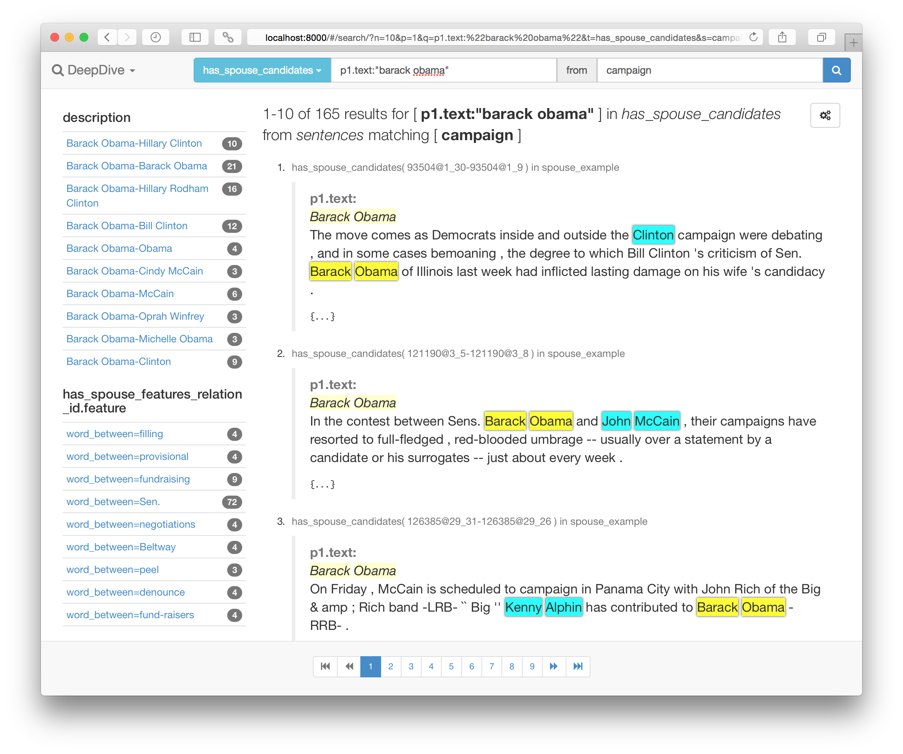

# Browsing DeepDive data with Mindbender

This document describes how one can easily bring up an interactive search interface to browse data produced by DeepDive as well as its input/source data.
Your DeepDive application must be written in DDlog to be able to use this functionality.

Currently, the functionality only works with PostgreSQL versions 9.3 or later because it relies on the `to_json()` support.
We plan to lift this limitation soon and support Greenplum/PostgreSQL-XL as well as to grow the underlying [Elasticsearch][] cluster for applications with large data.


## QuicksStart

### 1. Annotate DDlog relations
First of all, you must add some *annotations* to the DDlog schema declarations of the relations to be browsed.
Annotations are extra information placed before the relation name or column name in DDlog schema declarations that are written like `@extraction` or `@references(relation="foo", column="bar")`.
There's [an example of a DDlog program annotated for browsing](https://github.com/HazyResearch/mindbender/blob/master/examples/spouse_example/app.ddlog).

1. Associations between relations are annotated with `@key` and `@references` columns.
    For example, the following annotates that `entity`'s `doc_id` refers to a `document`.

    ```
    document( @key  id text, ... ).
    entity( ...,  @references(relation="documents", column="id")  doc_id text ).
    ```

2. Relations to be made browsable are annotated with either `@extraction` or `@source`.
    * All other relations associated with `@references` and `@key` are nested under the browsable relation.
    * An `@extraction` relation should have `@references` columns to a `@source` relation.

3. All columns of the browsable relations are full-text searchable.

4. `@searchable` columns are used for presenting the search results with highlights.

5. `@navigable` columns and `@searchable` columns are used for faceted navigation.


### 2. Populate the search index
Next, the relations to be browsed must be added to the search index, powered by [Elasticsearch][].

[Elasticsearch]: https://www.elastic.co/products/elasticsearch

```bash
mindbender search update
```

### 3. Start the GUI
Finally, a GUI can be started with the following command:

```bash
mindbender search gui
```

Point your browser to <http://localhost:8000/#/search> to start searching and browsing the indexed relations.



[Elasticsearch manual on query string syntax](https://www.elastic.co/guide/en/elasticsearch/reference/current/query-dsl-query-string-query.html#query-string-syntax) tells you how to formulate sophisticated query strings that can limit fields, do wildcards, fuzzy search, regular expressions, filtering, and grouping with boolean operators.


----

## Typical schema in DDlog/DeepDive
DeepDive applications written in DDlog typically use multiple relations falling into one of the following categories:

1. Relation that holds source (input) data
    * text corpus with NLP markups
    * dictionaries, controlled vocabularies
    * ontologies, knowledge bases, known relationships
2. Relation that holds extractions
    * candidates
    * mentions, relationship mentions, entity links
    * features
    * supervision labels
3. Relation that holds predictions (random variables)
    * whose expectation predicted by DeepDive

For example, in the spouse example we use in [DeepDive's tutorial](example-spouse.md), the relations are:

1. Source
    * `articles`
    * `sentences`
    * `spouse_dbpedia`
2. Extraction
    * `person_mention`
    * `spouse_candidate`
    * `spouse_feature`
    * `spouse_label`
3. Prediction
    * `has_spouse`


## DDlog annotations for browsing

DDlog allows relations and columns in the schema to be annotated with any number of annotations with `@name(arguments)` syntax.
Arguments are optional, e.g., `@tag` is also a valid annotation.
Arguments can be either an unnamed list of values, e.g., `@foo(1,"two", 3.45)`, or a map of named values, e.g., `@bar(number=1,string="two",double=3.45)`.
Permitted argument values are integers, floating point numbers, or strings.

### Annotations for association between DDlog relations
#### `@key` columns
Every relation can have one or more columns annotated with `@key`.
A relation's primary key should be the only column annotated with this.
When more than one column is annotated, it means all of them combined form a key for the tuples in the relation.
#### `@references(relation, [column], [alias])` columns
Columns whose value references another relation's key can be annotated with `@references` with the target relation name as a relation argument.
When more than one column forms a key for the target relation, the target column name to which the annotated column refers should also be passed as an extra column argument.
When a relation references the same relation more than one time that is typical for homogeneous relationships, e.g., `has_spouse` referring to `person_mention` twice, an extra alias argument can be provided for clarity.
If the target relation has multiple `@key` columns, the alias argument must be specified to distinguish exactly which `@key` column in the target relation the annotated column refers to.
In such case, the `@references` columns with the same alias argument as a whole tells to which tuple in the target relation it's referring.

### Annotation for extractions and search
One of the main consumers of DDlog annotations is the search interface.
It enables full-text search over the data products of DeepDive applications as well as their input data.
Elasticsearch is used in the backend, and the DDlog annotations dictate how the data produced by DeepDive stored in a relational database should be unloaded and transformed into Elasticsearch's document model to answer typical keyword and aggregate queries.

#### `@extraction([label])` relations
A relation that holds extracted data can be annotated as `@extraction` with an optional label.
In the search interface, `@extraction` relation becomes a searchable "type" and every tuple of it becomes the unit of search results.
If an extraction is represented by many DDlog relations all associated through `@references`, only the primary relation needs such annotation, e.g., only `person_mention` and `has_spouse` need `@extraction` because `spouse_feature` holds extra/auxiliary information related to `has_spouse`.

#### `@searchable([relation, ...])` columns
Any column annotated with `@searchable` that's directly or indirectly associated with an `@extraction` relation (or a relation that corresponds to a searchable type) is indexed for searching and appears in the result highlighted.
Optionally, names of the `@extraction` relations can be specified as arguments to limit the search indexes the column participates in.

#### `@source([label])` relations
A relation that holds the input/source data to DeepDive should be annotated as `@source` with optional label.
The `@source` relations themselves become a searchable type in the search interface as well.
Every `@extraction` relation is supposed to record its provenance in column(s) that `@references` one of the `@source` relations.
There are two reasons why `@source` relations are explicitly annotated.
First, since the typically larger `@source` relations may change less frequently than the `@extraction`s derived from them as the DeepDive application evolves, we can avoid reindexing a large part of the data that stays mostly invariant.
Specifically, Elasticsearch's parent-child mapping is used to decouple the frequently changing `@extraction`s from their `@source`s.
Second, given how the searchable data to be indexed is determined from the annotations, `@source` relations provide natural breaking points while following the association links between relations.
In other words, because independent `@extraction`s can reference a `@source` relation as its provenance, to make each `@extraction` searchable, we may end up collecting data for all other `@extraction`s from the same `@source`.

### Annotation for aggregation / faceted search

#### `@navigable([relation, ...])` columns
Similar to `@searchable`, any column annotated with `@navigable` that's directly or indirectly associated with a relation that corresponds to a searchable type is indexed for faceted navigation.
Upon every search, handful of significant terms or value ranges found for the column will appear with their approximate counts to help narrowing down the search result.
For example, if `label` column is annotated as `@navigable`, every search result will show how many were distantly supervised as positive and negative examples among the result and quickly drill down to them.

### Annotation for presentation
<todo>Under development.  Use [custom templates](#customizing-presentation) for the moment.</todo>

In addition to the `@searchable` columns, typical `@extraction`s record extra provenance details with respect to the `@source`, and special presentation of the data is often necessary for human consumption.
For example, `person_mention` are text spans in sentences each of which is represented by an array of indexes to the tokens of the source sentence.
A sensible presentation of such array of indexes is highlighting the corresponding words in the original sentence text with different colors rather than just showing the raw numbers.
Similarly, tables, figures, images, and other data types all have a similar issue: extra columns of `@extraction`s typically hold extra detail that can be visualized in data-dependent ways.


## Customizing presentation

### Presentation templates
How a browsable relation is presented in the GUI can be fully customized by creating an HTML-like template under the DeepDive application.
For example, relation `has_spouse` is rendered using a template at `./mindbender/search-template/has_spouse.html` when it exists.
It is in fact an [AngularJS template](https://docs.angularjs.org/guide/templates) where the object to be rendered is accessible with scope variable `extraction` or `source`, depending on whether the browsable relation is an extraction or source.
For extractions, `source` variable may also point to its provenance source object.

Here's an example for rendering `has_spouse` in the spouse example as highlighted text spans with two colors.
The `mindtagger-word-array` and `mindtagger-highlight-words` are AngularJS directives provided by [Mindtagger, a tool for labeling data](labeling.md).

<!--

-->

```html
<a mb-search-link="{{extraction.p1.mention_text}}"><strong>{{extraction.p1.mention_text}}</strong></a>
--
<a mb-search-link="{{extraction.p2.mention_text}}"><strong>{{extraction.p2.mention_text}}</strong></a>
<br> E=<strong>{{extraction.expectation}}</strong>
<br><small class="text-muted">See all
    <a mb-search-link='feature:* "{{extraction.p1_id}}@{{extraction.p2_id}}"'>features</a>
    /
    <a mb-search-link='label:*   "{{extraction.p1_id}}@{{extraction.p2_id}}"'>labels</a>
</small>

<small class="text-muted">
    in <a mb-search-only="sentences" mb-search-link="{{extraction.p1.doc_id}} sentence_index:{{extraction.p1.sentence_index}}">sentence {{extraction.p1.sentence_index}}</a>
    in <a mb-search-only="articles"  mb-search-link="{{extraction.p1.doc_id}}">article({{extraction.p1.doc_id}})</a>:
</small>
<div mindtagger-word-array="source.tokens">
    <mindtagger-highlight-words from="extraction.p1.begin_index" to="extraction.p1.end_index" with-style="background-color: yellow;"/>
    <mindtagger-highlight-words from="extraction.p2.begin_index" to="extraction.p2.end_index" with-style="background-color: cyan;"/>
</div>
```


Without the template, the GUI would render by default a `has_spouse` in a hard-to-read format:


This is improved as shown below by creating the template above in the application:


### AngularJS extensions
To define further AngularJS extensions, such as directives or filters to be used in the templates, define a `mindbender.extensions` module in [`./mindbender/extensions.coffee`](../examples/spouse/mindbender/extensions.coffee) or `./mindbender/extensions.js`.
This can be very useful if you need to share some template fragments or scripts across many browsable relations.

```html

```
