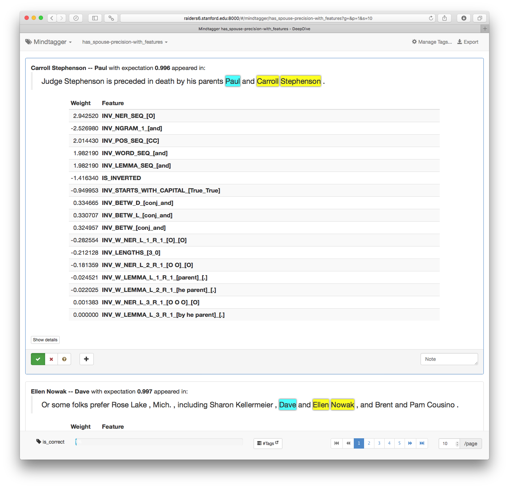

# Labeling Data Products of DeepDive

This document describes a common data labeling task one has to perform while developing DeepDive applications, and introduces a graphical user interface tool dedicated for accelerating such tasks.
We use the expressions annotating, marking, and tagging data interchangably with labeling the data.

To assess the performance of the DeepDive application, one typically measures the quality of its data products by computing the precision and recall.
Let's define some terms before we move on.
The *relevant* set is the exact set of information, e.g., entities or relationships, one wants to extract, while DeepDive's *positive* prediction is the set of information extracted by DeepDive whose assigned expectation value is greater than a certain threshold.
*Precision* is the ratio of the relevant ones in DeepDive's positive predictions.
Precision is 1 if DeepDive made no mistake in its predictions by assigning high expectation only to the relevant ones (no false positives).
As DeepDive assigns high expectation to more number of irrelevant ones, precision decreases.
On the other hand, *recall* is the ratio of DeepDive's positive predictions in all relevant ones.
Recall is 1 if DeepDive did not miss any relevant ones (no false negatives).
Recall decreases as DeepDive either assigns low expectation to more number of relevant ones or drops more of them during the candidate extraction steps.

Because the relevant set of a corpus is usually not known in advance, humans have to inspect a sample of DeepDive's predictions as well as the corpus, and answer whether each of them is relevant or not, to estimate the true values of such measures.
Estimating the precision can be as simple as randomly sampling predictions with expectation higher than a threshold, then counting how many were relevant.
However, estimating the recall accurately can be very costly as one needs to find enough number of relevant information sampled from the entire corpus.
In this document, we show how the task of precision estimation for a DeepDive application can be done in a systematic and convenient way using a graphical user interface.


## Mindtagger: A Tool for Labeling Data

*[Mindtagger][]* is a general data annotation tool that provides a customizable interactive graphical user interface.
For an annotation task it takes as input a list of items with a template that defines how each item should be rendered and what annotations can be added.
Mindtagger provides an interactive interface for humans to look at the rendered items and quickly go through each of them to leave annotations.
The annotations collected over time can then be output in various forms (SQL, CSV/TSV, and JSON) to be used outside of the tool, such as augmenting the ground truth of a DeepDive application.
Note that Mindtagger currently does not help the sampling part but only supports the labeling task of the precision/recall estimation.
Therefore, producing the right sample for correct estimation is Mindtagger user's responsibility.


### Use Case 1: Measuring Precision of the Spouse Example

In the following few steps, we explain how Mindtagger can help you perform a precision estimation task using the [spouse example in our walkthrough](walkthrough/walkthrough.html).

#### 1. Prepare the data items to inspect

First, you need to grab a reasonable number of samples for the precision task.
Using the SQL query shown below, you can get a hundred positive predictions (with threshold 0.9) of `has_spouse` relationship along with the array of words of the sentence the relationship was mentioned as well as two text spans mentioning the two persons involved.

```sql
-- generate-input.sql file

COPY (
    SELECT hsi.relation_id
         , s.sentence_id
         , description
         , is_true
         , expectation
         , s.words
         , p1.start_position AS p1_start
         , p1.length AS p1_length
         , p2.start_position AS p2_start
         , p2.length AS p2_length
         , p2.length AS p2_length
      FROM has_spouse_is_true_inference hsi
         , sentences s
         , people_mentions p1
         , people_mentions p2
     WHERE s.sentence_id = hsi.sentence_id
       AND p1.mention_id = hsi.person1_id
       AND p2.mention_id = hsi.person2_id
       AND expectation   > 0.9
  ORDER BY random() LIMIT 100
) TO STDOUT WITH CSV HEADER;
```

Let's keep the result of the SQL query in a file named `input.csv`.

```bash
psql -d deepdive_spouse -f "generate-input.sql" >"input.csv"
```

The lines in the generated `input.csv` should look similar to the following:

```
relation_id,sentence_id,description,is_true,expectation,words,p1_start,p1_length,p2_start,p2_length
[...]
124351@50_29-124351@50_64,124351@50,David S. Goyer-Hans Zimmer,,0.998,"{PRODUCTION,NOTES,:,`,THE,DARK,KNIGHT,',Directed,by,Christopher,Nolan,;,written,by,Jonathan,Nolan,and,Christopher,Nolan,"","",based,on,a,story,by,Christopher,Nolan,and,David,S.,Goyer,;,Batman,character,created,by,Bob,Kane,;,Batman,and,other,characters,from,the,DC,comic,books,;,director,of,photography,"","",Wally,Pfister,;,edited,by,Lee,Smith,;,music,by,Hans,Zimmer,and,James,Newton,Howard,;,production,designer,"","",Nathan,Crowley,;,produced,by,Charles,Roven,"","",Emma,Thomas,and,Christopher,Nolan,;,released,by,Warner,Brothers,Pictures,.}",29,3,64,2
68728@1_15-68728@1_3,68728@1,Robert B. Barnett-Rita Braver,1,,"{The,correspondent,"","",Rita,Braver,"","",told,viewers,that,her,husband,"","",the,Washington,lawyer,Robert,B.,Barnett,"","",had,represented,Cheney,in,the,publishing,deal,for,her,new,memoir,"","",``,Blue,Skies,"","",No,Fences,"","",'',which,served,as,the,main,peg,for,the,story,.}",15,3,3,2,\N
147788@36_39-147788@36_50,147788@36,Will Smith-Willie Brown,1,"{In,the,1990s,"","",the,Clintons,"","",unique,among,modern,first,families,"","",widened,the,circle,of,guests,and,political,contributors,who,were,invited,to,stay,over,"","",including,a,range,of,celebrities,and,politicians,like,Quincy,Jones,;,Will,Smith,and,his,wife,"","",Jada,Pinkett,Smith,;,and,Willie,Brown,.}",39,2,50,2
[...]
```

#### 2. Prepare Mindtagger configuration and template

In order to use these sampled data items with Mindtagger, you need to create two more files that define a task in Mindtagger: a configuration and a template.
Mindtagger configuration that looks like below should go into the `mindtagger.conf` file.
You can specify the path to the file holding the data items as well as the column names that are the keys, e.g., as `relation_id` in this example.

```
title: Example Mindtagger task for labeling false positives for calculating precision error
items: {
    file: input.csv
    key_columns: [relation_id]
}
template: template.html
```

As shown in the configuration, the template for the task is set to `template.html`.
A Mindtagger template is a collection of HTML fragments decorated with Mindtagger-specific directives that controls how the data items are rendered and what tags and GUI elements should be available during the task.
For the precision task at hand, creating a `template.html` file with contents similar to the following will do the job.


```html
<mindtagger mode="precision">

  <template for="each-item">
    <strong>{{item.description}}</strong> with expectation <strong>{{item.expectation | number:3}}</strong> appeared in:
    <blockquote>
        <big mindtagger-word-array="item.words" array-format="postgres">
            <mindtagger-highlight-words from="item.p1_start + 1" to="item.p1_start + item.p1_length" with-style="background-color: yellow;"/>
            <mindtagger-highlight-words from="item.p2_start + 1" to="item.p2_start + item.p2_length" with-style="background-color: cyan;"/>
        </big>
    </blockquote>

    <div mindtagger-item-details></div>
  </template>

  <template for="tags">
    <span mindtagger-adhoc-tags></span>
    <span mindtagger-note-tags></span>
  </template>

</mindtagger>
```


The template is mostly self explanatory, and you will notice some JavaScript-like expressions appearing here and there.
In fact, Mindtagger GUI is implemented with [AngularJS][] and you can use standard AngularJS expressions and directives to elaborate the template.
In addition to the standard ones, Mindtagger provides several domain-specific directives and variables scoped within the template, useful for creating the desired interface for data annotation.
For example, `mindtagger-word-array` directive makes it very simple to render an array of words, which is a commonly used data representation across many text and NLP-based DeepDive applications.
Also the column values of each item are available through the `item` variable.

#### 3. Launch Mindtagger

You can now launch Mindtagger passing the path to your `mindtagger.conf` file as a command-line argument, such as: `mindbender tagger ./mindtagger.conf`
Of course, you should first download [the mindbender binary][Mindbender releases] for your system, which includes Mindtagger, and install it as an executable in ones of your `$PATH` directories.

In fact, DeepDive bundles [a nice script that launches Mindtagger](https://github.com/HazyResearch/deepdive/blob/develop/examples/labeling/start-mindtagger.sh) and also handles the installation for you.
With that, you can simply run it to start Mindtagger with all tasks existing in a subdirectory next to the script.
For example, running the following command from the root of DeepDive's source tree will first install Mindtagger if necessary, then launch it with the example tasks.

```bash
./examples/labeling/start-mindtagger.sh
```

If the default port (8000) is already used by something else, you can specify an alternative port, say 12345 as follows:

```bash
PORT=12345 ./examples/labeling/start-mindtagger.sh
```


#### 4. Mark each prediction as correct or not
Now, you can point your browser to the URL displayed in the output of Mindtagger (or `http://localhost:8000` if that doesn't work).
The following screenshot shows the annotation task in progress.


For precision mode, Mindtagger provides dedicated buttons colored green/red for marking whether each item is relevant or not as the value for `is_correct` tag.
You should inspect each item, and mark your judgement by pushing the right button.
(Hint: You can also use the keyboard to mark your response and move between items.  Press <kbd>?</kbd> key for details.)

You can also add ad-hoc tags to each item, e.g., for marking the reason or type of error.
These tags will be very useful later for clustering the false positive errors based on their type.


#### 5. Counting annotations

While making progress on inspecting every item, you can quickly check how many items were labeled with each tag using the "Tags" dropdown on the top-right corner.


#### 6. Export annotations

Suppose you want to augment the ground truth with the `is_correct` tags you've marked on each item through this task.
Using Mindtagger's export tags feature ("Export" on the top-right), you can download the tag data as SQL with UPDATE or INSERT statements, as well as CSV/TSV or JSON.


The downloaded SQL file will look like the following, ready to fill in the `is_correct` column of the `has_spouse` table in your database:

```sql
UPDATE "has_spouse" SET ("is_correct") = (FALSE)	WHERE "relation_id" = '85736@18_4-85736@18_8';
UPDATE "has_spouse" SET ("is_correct") = (FALSE)	WHERE "relation_id" = '130601@26_34-130601@26_21';
UPDATE "has_spouse" SET ("is_correct") = (FALSE)	WHERE "relation_id" = '58803@18_42-58803@18_15';
UPDATE "has_spouse" SET ("is_correct") = (FALSE)	WHERE "relation_id" = '133318@46_20-133318@46_33';
UPDATE "has_spouse" SET ("is_correct") = (FALSE)	WHERE "relation_id" = '38897@10_23-38897@10_20';
UPDATE "has_spouse" SET ("is_correct") = (FALSE)	WHERE "relation_id" = '82383@26_59-82383@26_8';
UPDATE "has_spouse" SET ("is_correct") = (FALSE)	WHERE "relation_id" = '72549@33_42-72549@33_15';
UPDATE "has_spouse" SET ("is_correct") = (FALSE)	WHERE "relation_id" = '154431@2_99-154431@2_156';
UPDATE "has_spouse" SET ("is_correct") = (TRUE) 	WHERE "relation_id" = '154470@22_12-154470@22_8';
UPDATE "has_spouse" SET ("is_correct") = (FALSE)	WHERE "relation_id" = '102122@24_12-102122@24_8';
[...]
```

For other ad-hoc tags, exporting into different formats may be more useful.


### Example 2: Inspecting features

After inspecting a number of predictions for estimating precision, you may start to wonder what features for the probabilistic inference were produced for each item.
In this second example, we will show how you can extend the first example to include the features related to each prediction, so you can get a better sense of what's going on.
This is no longer a task for simply estimating a quality measure of the result, but rather a more elaborate error analysis task to understand what features are doing good/bad and to collect more insights for debugging/improving the DeepDive application.
Use of the ad-hoc tags will be much more important in this task, because it will help you prioritize fixing the more common source of errors.

#### 1. Prepare mentions with relevant features

You can use the following SQL query to include the features related to the prediction along with their weights.

```sql
COPY (
 SELECT hsi.relation_id
      , s.sentence_id
      , description
      , is_true
      , expectation
      , s.words
      , p1.start_position AS p1_start
      , p1.length AS p1_length
      , p2.start_position AS p2_start
      , p2.length AS p2_length
      , p2.length AS p2_length
      -- also include all relevant features with weights
      , features
      , weights
   FROM has_spouse_is_true_inference hsi
      , sentences s
      , people_mentions p1
      , people_mentions p2
      , ( -- find features relevant to the relation
         SELECT relation_id
              , ARRAY_AGG(feature ORDER BY abs(weight) DESC) AS features
              , ARRAY_AGG(weight  ORDER BY abs(weight) DESC) AS weights
           FROM has_spouse_features f
              , dd_inference_result_weights_mapping wm
          WHERE wm.description = ('f_has_spouse_features-' || f.feature)
          GROUP BY relation_id
        ) f
  WHERE s.sentence_id  = hsi.sentence_id
    AND p1.mention_id  = hsi.person1_id
    AND p2.mention_id  = hsi.person2_id
    AND f.relation_id  = hsi.relation_id
    AND expectation    > 0.9
  ORDER BY random() LIMIT 100
) TO STDOUT WITH CSV HEADER;
```

Running the SQL above will give you an `input.csv` that looks like:

```
relation_id,sentence_id,description,is_true,expectation,words,p1_start,p1_length,p2_start,p2_length,features,weights
[...]
82383@26_20-82383@26_44,82383@26,Hank Azaria-Randy Travis,,0.994,"{Former,Sen.,John,Edwards,of,North,Carolina,-,Don,Henley,"","",Larry,David,"","",Seth,Green,"","",Gary,Cole,"","",Hank,Azaria,"","",James,Denton,"","",Jean,Smart,"","",Richard,Gilliland,"","",Tony,Shalhoub,Gov.,Bill,Richardson,of,New,Mexico,-,Rob,Reiner,"","",Randy,Travis,"","",Al,Unser,"","",Barry,Switzer,"","",Val,Kilmer,"","",Jimmy,Smits,Sen.,Chris,Dodd,of,Connecticut,-,Steve,Martin,"","",Paul,Newman,"","",Lorne,Michaels,"","",Paul,Simon,"","",Elisabeth,Shue,"","",Michael,Douglas,.}",20,2,44,2,"{word_between=Bill,word_between=Tony,word_between=Richardson,word_between=Richard,word_between=New,num_words_between=22,""word_between=,"",word_between=James,word_between=Reiner,word_between=Rob,word_between=-,word_between=Mexico,word_between=of,word_between=Jean,word_between=Gov.,word_between=Gilliland,word_between=Denton,word_between=Shalhoub,word_between=Smart}","{-1.58548,1.45956,1.26088,1.04475,0.630963,0.45178,-0.438738,-0.347285,-0.333577,0.324225,0.30644,0.233578,0.223005,-0.139167,-0.0108343,0,0,0,0}"
[...]
```

#### 2. Modify template to also render features

Now, we can use the following Mindtagger template to enumerate the extra feature information.


```html
<mindtagger mode="precision">

  <template for="each-item">
    <strong title="relation_id: {{item.relation_id}}">{{item.description}}</strong> with expectation <strong>{{item.expectation | number:3}}</strong> appeared in:
    <blockquote>
        <big mindtagger-word-array="item.words" array-format="postgres" title="sentence_id: {{item.sentence_id}}">
            <mindtagger-highlight-words from="item.p1_start" to="item.p1_start + item.p1_length - 1" with-style="background-color: yellow;"/>
            <mindtagger-highlight-words from="item.p2_start" to="item.p2_start + item.p2_length - 1" with-style="background-color: cyan;"/>
        </big>
    </blockquote>

    <!-- Enumerate features with weights (leveraging AngularJS a bit more)-->
    <div class="row">
      <div class="col-sm-offset-1 col-sm-10">
        <table class="table table-striped table-condensed table-hover">
          <thead><tr>
              <th class="col-sm-1">Weight</th>
              <th>Feature</th>
          </tr></thead>
          <tbody>
            <tr ng-repeat="feature in item.features | parsedArray:'postgres'">
              <td class="text-right">{{(item.weights | parsedArray:'postgres')[$index] | number:6}}</td>
              <th>{{feature}}</th>
            </tr>
          </tbody>
        </table>
      </div>
    </div>

    <div>
      <div mindtagger-item-details></div>
    </div>
  </template>

  <template for="tags">
    <span mindtagger-adhoc-tags></span>
    <span mindtagger-note-tags></span>
  </template>

</mindtagger>
```



#### 3. Browse the predictions with features and weights

Now, you can see all the features next to their learned weights as below.
By looking at the features through this task, you may discover some good or bad features, and can come up with a more data-driven idea for improving the application's performance on your next iteration.




[Mindtagger]: https://github.com/netj/mindbender/wiki/Mindtagger
[Mindbender releases]: https://github.com/netj/mindbender/releases
[AngularJS]: https://angularjs.org/
