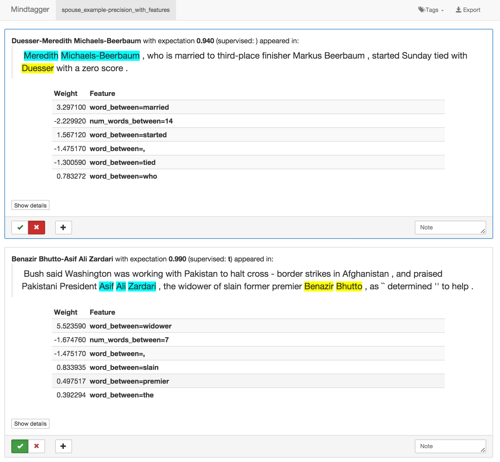
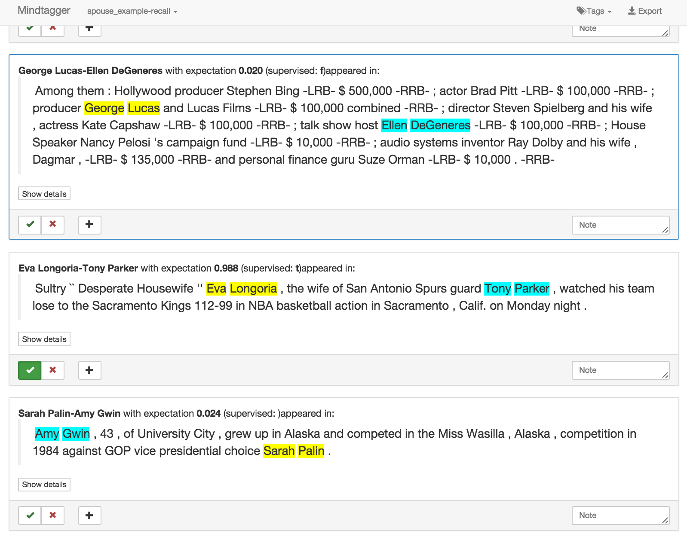
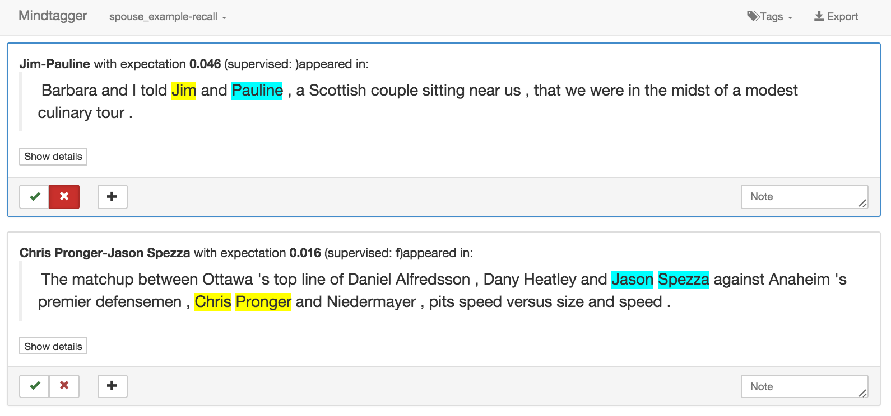

# Example Application: Improving the Results

This document describes how to improve the marriage relation mention extractor
built in [Example Application: A Mention-Level Extraction
System](walkthrough.html).

<a name="improve" href="#"> </a>

## Contents

- [Error Analysis](#error-analysis)
  - [Using BrainDump to generate automatic reports](#braindump)
  - [Using MindTagger to label results](#mindtagger)
- [Improvements using Generic Feature Library](#feature-library)
  - [Mitigate overfitting with automatic regularization](#regularization)
- [Further improvement: adding data](#error-analysis-2)
- [Analyzing recall](#recall)


Other sections in the tutorial:

- [A Mention-Level Extraction System](walkthrough.html)
- [Extras: preprocessing, NLP, pipelines, debugging extractor](walkthrough-extras.html)

## <a name="error-analysis" href="#"> </a> Error Analysis
After the execution of an application, it is necessary to assess the quality of
its results. We consider any relation candidate that gets assigned a
probability at least 0.9 of expressing a marriage relation as "extracted" by the
system (i.e., the system classifies it as expressing a marriage relation), and
we refer to the set of these candidates as "*extractions*". Note that the choice
of the threshold value (0.9 in our case) is application-dependent, but 0.9 is a
reasonable choice in most cases.

A common measure of quality is *precision*, i.e., the fraction of extractions
that are indeed expressing a marriage relation. Another quality measure of
interest is *recall*, which is the fraction of candidates expressing marriage
relations that appear in the extractions. 

For now, we focus on assessing and improving *precision*. This may have
an impact on recall (there is a somewhat natural tradeoff between the two), but
we remark that it is important to first obtain high precision in the
extractions and then one can focus on recall: a large of extractions with high
recall and low precision is not at all as useful in practice as a smaller set
with higher precision and somewhat lower recall.

DeepDive comes with a set of tools that makes it easier for the user to assess
the quality of the extractions, analyze the systematic errors made by DeepDive,
and therefore improve the quality of an application. In this section, we
describe how to set up and use these tools to evaluate the results obtained by
running the application we developed in the [previous
section](walkthrough.html), and to improve the quality of the extractions.

### <a name="braindump" href="#"> </a> Using BrainDump to generate automatic reports

We start by setting up [BrainDump](https://github.com/zifeishan/braindump), the
automatic report generator for DeepDive. BrainDump creates a set of reports
containing informative descriptive statistics about the last execution of
DeepDive, and it also creates the input for our result labeling tool MindTagger,
which we describe next.

#### Braindump setup and configuration

We provide a script `./get-braindump.sh` in the folder
`$DEEPDIVE_HOME/examples/tutorial_example/step1-basic/` to download and install
BrainDump. After running the script, BrainDump will be installed in your user home
directory (`$HOME`), as `$HOME/local/bin/braindump`. From now on, we refer to this
executable as `braindump`.  

`braindump` requires a configuration file `braindump.conf` to be put in
`$APP_HOME`, which should be created as below:

<!--
You can use the one in
`$DEEPDIVE_HOME/examples/tutorial_example/step1-basic/braindump.conf`:
-->

<!--
The first time you run `braindump` from `$APP_HOME`, it presents an interactive
command line interface to create the configuration file `braindump.conf`. The
created file should look like the following. 
A copy of this file can be
found in `$DEEPDIVE_HOME/examples/tutorial_example/step1-basic/braindump.conf`.
-->

```bash

########## Conventions. Do not recommend to change. ###########

# Set the utility files dir
export UTIL_DIR="$HOME/local/braindump"

# Report folder: use current
export REPORT_DIR="$WORKING_DIR/experiment-reports"

########## User-specified configurations ###########

# Directories

# Use absolute path if possible.
# Avoid using "pwd" or "dirname $0", they don't work properly.
# $WORKING_DIR is set to be the directory where braindump is running. 
# (the directory that contains braindump.conf)
export APP_HOME=$WORKING_DIR

# Specify deepdive out directory ($DEEPDIVE_HOME/out)
export DD_OUTPUT_DIR=$DEEPDIVE_HOME/out

# Database Configuration
export DBNAME=deepdive_spouse
export PGUSER=${PGUSER:-`whoami`}
export PGPASSWORD=${PGPASSWORD:-}
export PGPORT=${PGPORT:-5432}
export PGHOST=${PGHOST:-localhost}

# Specify all feature tables. 
# e.g. FEATURE_TABLES=(f1 f2 f3)
export FEATURE_TABLES=(has_spouse_features)
export FEATURE_COLUMNS=(feature)

# Specify all variable tables
export VARIABLE_TABLES=(has_spouse)
export VARIABLE_COLUMNS=(is_true)
# Assume that in DeepDive, inference result tables will be named as [VARIABLE_TABLE]_[VARIABLE_COLUMN]_inference

# If the variable is a mention, specify the words / description for the mention. 
# This is used for a statistics with naive entity linking. If empty, do not count deduplicated mentions.
# e.g. export VARIABLE_WORDS_COLUMNS=(w1 "" w3)
# In the examples above, the second element is left empty
export VARIABLE_WORDS_COLUMNS=(description)

# Set variable docid columns to count distinct documents that have extractions
# export VARIABLE_DOCID_COLUMNS=()

# Code configs to save
export CODE_CONFIG=

# Number of samples
export NUM_SAMPLED_FEATURES=100
export NUM_SAMPLED_SUPERVISION=500
export NUM_SAMPLED_RESULT=1000
export NUM_TOP_ENTITIES=50

# Specify some tables for statistics
export SENTENCE_TABLE=sentences
export SENTENCE_TABLE_DOC_ID_COLUMN=document_id

# Define how to send result. use "true" to activate.
export SEND_RESULT_WITH_GIT=false
# If true, push after commiting the report
export SEND_RESULT_WITH_GIT_PUSH=false
export SEND_RESULT_WITH_EMAIL=false

######## CUSTOM SCRIPTS ###########
# Leave blank for default stats report.
# Set to a location of a script (e.g. $APP_HOME/your_script) to use it instead of default 

# Self-defined scripts for stats. 
export STATS_SCRIPT=
export SUPERVISION_SAMPLE_SCRIPT=
export INFERENCE_SAMPLE_SCRIPT="$APP_HOME/bdconfigs/sample-inference.sh"

########## Conventions. Do not recommend to change. ###########

# Hack: use the last DD run as output dir
# Suppose out/ is under $DEEPDIVE_HOME/
# You may need to manually change it based on need
export DD_TIMESTAMP=`ls -t $DD_OUTPUT_DIR/ | head -n 1`
export DD_THIS_OUTPUT_DIR=$DD_OUTPUT_DIR/$DD_TIMESTAMP

```

Note that we customize the variable `INFERENCE_SAMPLE_SCRIPT` to our customized script 
`$APP_HOME/bdconfigs/sample-inference.sh`, which can be found in 
`$DEEPDIVE_HOME/examples/tutorial_example/step1-basic/bdconfigs/sample-inference.sh`. 
This script is used to get 100 random extractions with expectation > 0.9, 
which we will use in later steps. Copy the `bdconfigs` folder into 
your `$APP_HOME` to make it work:

```bash
cp -r $DEEPDIVE_HOME/examples/tutorial_example/step1-basic/bdconfigs ./
```

#### Run BrainDump

Once BrainDump has been configured, we can run `braindump` from the `$APP_HOME`
directory to generate an automatic report for the last DeepDive run. Since we
want to create and examine a report after each run of DeepDive, we can modify
the `run.sh` script to execute `braindump` after running the application:

```bash
#! /bin/bash

... # YOUR OTHER CONFIGURATIONS IN run.sh...

cd $DEEPDIVE_HOME

# Be sure to set this so that you are able to QUIT if deepdive fails.
set -e

# Run with deepdive binary:
deepdive -c $APP_HOME/application.conf

# Note that you should go back to your APP_HOME directory to run braindump
cd $APP_HOME  
braindump
```

If your last run of DeepDive was successful, now you can run `braindump` once, under `$APP_HOME`:

```
braindump
```

#### Examining the report

The auto-generated report resides in a sub-folder of
`$APP_HOME/experiment-reports/`. At this time, there should be only one
subdirectory `v00001` and a link `latest` to it. This directory contains some
other folders and a `README.md` file, the report. The report contains a number
of informative statistics about the corpus and about the extractions, including
the number of generated mention candidates, information about the training set,
the number of extractions, and counts for the most frequently extracted entity
pairs. It should look similar to the
following:

```
# Statistics
     number_of_documents
    ---------------------
                   14230
    (1 row)

     number_of_sentences
    ---------------------
                   55507
    (1 row)

## Variable has_spouse
     mention_candidates
    --------------------
                 291986
    (1 row)

    Supervision statistics:
     is_true | count
    ---------+--------
     t       |  23580
     f       |  84578
             | 183828
    (3 rows)

     extracted_mentions
    --------------------
                   5442
    (1 row)

     extracted_entities
    --------------------
                   3669
    (1 row)

### Top entities
    Asif Ali Zardari-Benazir Bhutto     67
    Benazir Bhutto-Asif Ali Zardari     66
    Bill Clinton-Hillary Rodham Clinton 37
    Britney Spears-Kevin Federline      37
    Kevin Federline-Britney Spears      37
    Hillary Rodham Clinton-Bill Clinton 36
    Madonna-Guy Ritchie 31
    Guy Ritchie-Madonna 30
    Nicolas Sarkozy-Carla Bruni 27
    Carla Bruni-Nicolas Sarkozy 26

```

From the Top Entities section, one may think that the system is actually doing a
good job at extracting marriage relation mentions, but this may not be true.  To
precisely assess the quality of the results and diagnose what errors the system
makes, we should look at actual examples of extractions and verify how many of
them are indeed representing marriage relations, how many are not, and why are
non-correct candidates assigned a high probability. This task is called *error
analysis*. 

Deepdive includes a tool named [MindTagger](../labeling.html) that simplifies
the execution of error analysis.

### <a name="mindtagger" href="#"> </a> Using MindTagger to label results

We now conduct the error analysis based on our initial spouse relation mention
extractor developed in the [first part of the tutorial](walkthrough.html). 

We use [MindTagger](../labeling.html) to inspect and label 100 extractions.
A random sample of 100 extractions is usually sufficiently large to correctly
assess precision and to identify the most common sources of error. For more
information about the labeling process, please refer to the
[MindTagger](../labeling.html) page, which describes in depth how to use the
tool, with specific examples that use the spouse application. 

The goal of the labeling task with MindTagger is to identify categories of
misclassified relation candidates, and to understand why the system does not
classify them correctly. This requires inspecting the features associated to
each extraction and their weight, assessing whether the features with high or
low weight are meaningful and can indeed help the system classify the relation
candidates (i.e., they should be associated with correct or incorrect
relations). For example, assume that by analyzing the extractions we find that
the system extracts many incorrect relation candidates whose mentions are
separated by the word "and", e.g., "Barack Obama and Hillary Clinton". We look
at the feature `NGRAM_1_[and]` which denotes the presence of the word "and"
between the mentions, and find that it is associated with a high weight (say
1.2). This suggests that the training set does not contain a sufficient number
negative examples of relation candidates whose mentions are separated by "and":
the system learns, from the existing evidence, that having "and" between the
mentions is frequently associated with correct relations, and therefore assigns
a high weight to the corresponding feature. To fix this class of error, the
solution would be to increase the number of negative examples with this feature,
which may require additional supervision rules, a richer knowledge base for the
existing supervision rules, or additional manual labelling. This is just an
example of the kind of reasoning that should be done while performing error
analysis.

The input to MindTagger can be automatically generated from the output of
BrainDump as follows. Copy the directory
`$DEEPDIVE_HOME/examples/tutorial_example/step1-basic/labeling/` to your
`$APP_HOME` directory

```
cp -r $DEEPDIVE_HOME/examples/tutorial_example/step1-basic/labeling/ $APP_HOME/labeling
```

Now, run the `prepare-data-from-braindump.sh` script located inside the
`labeling` directory:

```
cd $APP_HOME/labeling
./prepare-data-from-braindump.sh
```

The script will output a success message, and we are now ready to start
MindTagger:

```
cd $APP_HOME/labeling
./start-mindtagger.sh
```

We can now open a browser, go to `localhost:8000` and perform the labeling of
the extractions as described in the [MindTagger](../labeling.html)
documentation. You should be able to see an interface like the following 
screenshot:




In the directory `$DEEPDIVE_HOME/examples/tutorial_example/step1-basic/labeling`,
we include a sample of 100 extractions that we already labelled using
MindTagger. To look at our labeling results, you can enter this directory, run
`./start-mindtagger.sh` and point your browser to `localhost:8000`. In our case,
the precision is 40%: out of 100 extractions, 40 are actually expressing a
marriage relation. 

<blockquote>Precision of basic tutorial: 40%.</blockquote>

By analyzing the misclassified relations we observe
that the current set of features is not sufficiently rich and expressive to
allow the system to learn how to correctly classify relation candidates. For
example, if there is a word like "married", "husband" or "wife" between the sentences, then
the relation candidate is likely to be assigned a high probability. At the same time,
features that are not indicative of a marriage relation (e.g.,
`word_between=started` in the above screenshot) gets assigned a very high weight (1.567), which is
a sign of overfitting. 

With the goal of improving the quality of the extractions, in the next
section we first describe how to easily enrich the set of features using the
[generic feature library](../gen_feats.html) included in Deepdive, and then
describe how to mitigate overfitting by letting the system select a
regularization parameter automatically.

## <a name="feature-library" href="#"> </a> Improvements using Generic Feature Library

The set of features initially chosen for an application may often seem, before
performing an error analysis, to be rich and expressive enough to allow the
system to distinguish between correct and incorrect relation candidates. More
often than not, this is not the case, as we saw in the previous section. Indeed
*feature engineering*, the task of developing a set of features that lead to
high precision, is known to be challenging.

Based on our multi-year experience developing high-quality KBC systems, we
developed a [generic feature library](../gen_feats.html) which is included in
DeepDive as part of the `ddlib` utility library. The generic feature library
automatically generates sets of features that are "generic" in the sense that they
are not specifically designed for a particular application or domain, but they
have been proven to be powerful and sufficient to obtain good quality results.

We now briefly introduce the use of the generic feature library in our example
application. We refer the reader to the documentation of the [generic feature
library](../gen_feats.html) for more information about which features are
generated and details on how to use the library.

The generic features library allows to incorporate some application-specific
knowledge in the set of features in the form of *dictionaries*, i.e., sets of
*keywords*. The generic features library uses these keywords to generate
additional features when a keyword appears in the same sentence as a relation
candidate. We create two *dictionaries*, i.e., files containing keywords that
can help distinguish between spouse relation and non-spouse relations, like
"husband", "daughter", "fiancee", and so on. These lists do not contain all
possible keywords (such a list would probably be impossible to even imagine),
but they can still help the system learn how to distinguish between correct and
incorrect relations. 

We created one dictionary `married.txt` for keywords that are usually associated
with correct marriage relations, and another dictionary `non_married.txt` for
keywords that are usually associated with relations that are not about marriage.
These files can be found in
`$DEEPDIVE_HOME/examples/tutorial_example/step2-generic-features/udf/dicts/`.
Copy this directory to your `$APP_HOME/udf/` directory:

```
cp -r $DEEPDIVE_HOME/examples/tutorial_example/step2-generic-features/udf/dicts/ $APP_HOME/udf/dicts
```

We now modify our feature extractor script `has_spouse_features.py` to use the
generic feature library and the dictionaries. The new version of the script can
be found in
`$DEEPDIVE_HOME/examples/tutorial_example/step2-generic-features/udf/` and can be
copied over the old one in `$APP_HOME/udf`. The content of the script are the
following:

```python

#! /usr/bin/env python

import sys, os
import ddlib     # DeepDive python utility

ARR_DELIM = '~^~'

# Load keyword dictionaries using ddlib, for domain-specific features
# Words in "married" dictionary are indicative of marriage
# Words in "non_married" dictionary are indicative of non_marriage
BASE_DIR = os.path.dirname(os.path.realpath(__file__))
ddlib.load_dictionary(BASE_DIR + "/dicts/married.txt", dict_id="married")
ddlib.load_dictionary(BASE_DIR + "/dicts/non_married.txt", dict_id="non_married")

# For each input tuple
for row in sys.stdin:
  parts = row.strip().split('\t')
  
  # Get all fields from a row
  words = parts[0].split(ARR_DELIM)
  lemmas = parts[1].split(ARR_DELIM)
  poses = parts[2].split(ARR_DELIM)
  dependencies = parts[3].split(ARR_DELIM)
  ners = parts[4].split(ARR_DELIM)
  relation_id = parts[5]
  p1_start, p1_length, p2_start, p2_length = [int(x) for x in parts[6:]]

  # Skip lines with empty dependency paths
  if len(dependencies) == 0:
    print >>sys.stderr, str(relation_id) + '\t' + 'DEP_PATH_EMPTY'
    continue

  # Get a sentence from ddlib -- array of "Word" objects
  try:
    sentence = ddlib.get_sentence(
        [0, ] * len(words),  [0, ] * len(words), words, lemmas, poses,
        dependencies, ners)
  except:
    print >>sys.stderr, dependencies
    continue
  
  # Create two spans of person mentions
  span1 = ddlib.Span(begin_word_id=p1_start, length=p1_length)
  span2 = ddlib.Span(begin_word_id=p2_start, length=p2_length)

  # Features for this pair come in here
  features = set()

  # Get generic features generated by ddlib
  for feature in ddlib.get_generic_features_relation(sentence, span1, span2):
    features.add(feature)
  for feature in features:
    print str(relation_id) + '\t' + feature
```

The dictionaries are loaded by calling the `ddlib.load_dictionary` function,
while the set of features is obtained through the
`ddlib.get_generic_features_relation`. More details about the generic feature
library can be found in its [documentation](../gen_feats.html).

The generic feature library uses additional columns of the `sentences` table to
generate the feature, therefore we need to modify the `input` of the
`has_spouse_features` extractor definition in `application.conf` (a modified
version of `application.conf` is available at
`$DEEPDIVE_HOME/tutorial_example/step2-generic-features/application.conf`):

```bash
    ext_has_spouse_features {
      input: """
        SELECT  array_to_string(words, '~^~'),
                array_to_string(lemma, '~^~'),
                array_to_string(pos_tags, '~^~'),
                array_to_string(dependencies, '~^~'),
                array_to_string(ner_tags, '~^~'),
                has_spouse.relation_id,
                p1.start_position,
                p1.length,
                p2.start_position,
                p2.length
        FROM    has_spouse,
                people_mentions p1,
                people_mentions p2,
                sentences
        WHERE   has_spouse.person1_id = p1.mention_id
          AND   has_spouse.person2_id = p2.mention_id
          AND   has_spouse.sentence_id = sentences.sentence_id;
        """
      output_relation: "has_spouse_features"
      udf: ${APP_HOME}"/udf/ext_has_spouse_features.py"
      dependencies: ["ext_has_spouse_candidates"]
      style: "tsv_extractor"
      parallelism: 4
    }
```

### <a name="regularization" href="#"> </a> Mitigate overfitting with automatic regularization

In order to mitigate the effect of overfitting, we can use a functionality
offered by the [DimmWitted! Sampler](../sampler.html) to automatically pick
(from a user-specified set) a good value for *regularization*. Regularization is a
standard machine learning technique to mitigate the effect of overfitting. 
It is critical when we use the generic feature library, since the library 
yields a lot of features and many of them may be irrelevant.

The Gibbs sampler in DeepDive accept one or more `--reg_param VALUE` options that
can be used to specify a set of possible regularization values. The system
will use 2-fold cross validation on the training set to select the best
parameter value among those specified. A technical detail: the best parameter,
as chosen by the system, is the one with the highest harmonic mean of the
F1-score in the cross validation.

To specify a set of regularization parameters among which to choose, and in
general to pass arguments to the sampler, we can add the following line to
`application.conf`, in the `deepdive` section:

```bash
deepdive {
  [... other configuration directives ...]
  sampler.sampler_args: "-l 300 -s 1 -i 500 --alpha 0.1 --diminish 0.99 --reg_param 0.1 --reg_param 1 --reg_param 10"
}
```

For an explanation of all the parameters passed to the sampler, check the
[sampler documentation](../sampler.html).

Now that we have performed some changes to the application (generic feature
library, and automatic regularization) we can run the application again by
executing `./run.sh`.

Once the application has completed successfully, we can perform another round of
error analysis by looking at another 100 extractions using MindTagger to assess
the changes in the precision of the extractions due to the use of the generic
feature library. 

We already labelled 100 extractions using MindTagger. You can look at the
results of our labeling by entering the directory
`$DEEPDIVE_HOME/examples/tutorial_example/step2-generic-features/labeling`,
running `./start-mindtagger.sh` and opening your browser to the address
`localhost:8000`. We obtained a significant increase in the precision, which is
now 86%.

<blockquote>Precision after adding feature library: 86%.</blockquote>

## <a name="error-analysis-2" href=#> </a> Further improvements: adding data

We can further improve the precision by using more data: having additional data
allows the system to gather more evidence and learn better weights for the
features. 

The data archive that we downloaded at the beginning of the tutorial contains a
additional dataset with more sentences that contains more negative examples
(`$APP_HOME/data/sentences_dump_large.csv`).  Copy the file
`$DEEPDIVE_HOME/examples/tutorial_example/step3-more-data/run.sh`, and the file
`$DEEPDIVE_HOME/examples/tutorial_example/step3-more-data/setup_database.sh` to
the `$APP_HOME` directory, and execute `./run.sh`: it will setup a new database
`deepdive_spouse_large` containing the enlarged dataset and run the application
using this database. 

At the end, you can analyze the results using MindTagger as described before,
but make sure to update the database name in `braindump.conf`:

```bash
# Other configurations in braindump.conf...
export DBNAME=deepdive_spouse_large
# ...

```

We labelled 100 extractions using MindTagger and found that the precision is now
94%, which is satisfactory. You can see our labelling results by entering the
`$DEEPDIVE_HOME/examples/tutorial_example/step3-more-data/labeling` directory
and running `./start-mindtagger.sh`.

<blockquote>Precision after adding more data: 94%.</blockquote>

In this section we showed only some basic examples of the actions that can be
taken to improve the quality of an application. Many more are possible, for
example adding additional supervision rules or specifying additional
correlations among the variables using inference rules. Actions should be taken
according to the results of error analysis. For a detailed discussion, please 
refer to this paper:
[Feature Engineering for Knowledge Base Construction](http://arxiv.org/abs/1407.6439).

## <a name="recall" href="#"> </a> Evaluating recall

We can use MindTagger also to evaluate recall, i.e., the fraction of candidates
expressing a marriage relation that is actually extracted (i.e., assigned a
probability at least 0.9). Note that in this section, we are only 
assessing the recall of extractions with regards to the candidates, 
ignoring the imperfection of the candidate generation.

We start by preparing some data for MindTagger that allows for the evaluation of
recall. Copy the script
`$DEEPDIVE_HOME/examples/tutorial_example/step3-more-data/labeling/prepare-data-for-recall.sh`
and the directory
`$DEEPDIVE_HOME/examples/tutorial_example/step3-more-data/labeling/spouse_example-recall/`
to `$APP_HOME/labeling` and execute the script (we assume that the last execution of the
application was using the `deepdive_spouse_large` database created at the end of
the previous section. If that is not the case, edit the script and set the
`DBNAME` directory to the correct database). This script collects two thousands
sentences containing at least one relation mention candidate, independently from
the predicted probability. 

Once the script has completed, start MindTagger with `./start-mindtagger.sh`.
Point your browser to `localhost:8000` and make sure that on the left of the
upper bar of the page, the `spouse_example-recall` task is selected (otherwise
select it). 

You should be able to see the interface similar as below:



The labelling task to compute recall is only slightly more complex than the task
for precision. You should look at each presented candidate and at the value of the
expectation assigned to it. You should first evaluate if a candidate is
expressing a marriage relation or not. If not, you can go on to the next
candidate. Otherwise, if the candidate *is* expressing a marriage relation, you
should look at the value of the expectation assigned to it. If it is greater
than 0.9, you can mark the extraction as correct (green button), otherwise, the
candidate was "missed", as it was not part of the extractions, and should be
marked as such using the red button. As with the precision task, you can add
tags to the candidates to help you in classifying the errors. Please remember
that you should only mark as "missed" the candidates that are actually
expressing a marriage relation but have a low expectation. You can completely
ignore candidates not expressing a marriage relation, independently of the
expectation that it is assigned to them. Once you have labeled (or ignored) all
candidates, the recall can be computed as the fraction between the number of
extracted candidates that express a marriage relation ("green") over the sum
between the total number of candidates that express a marriage relation ("green
plus red").

The above screenshot shows an example of "correct" extraction, and below shows an example of "missed" candidates:



We performed the labeling over 1,000 candidates, and found a recall of 19%. 
While this is not very
satisfactory, remember that all the steps we took earlier in this section were
focused on improving precision, without even assessing or considering the impact
on recall.

<blockquote>Recall after adding more data: 19%.</blockquote>

A low recall can be due to excessive sparsity of the features, classes of
correct candidates that are not "covered" by the current supervision rules,
extremely low weights for features usually associated with correct candidates,
and so on. We are currently developing tools and documentation to address some
of these issue. STAY TUNED!


