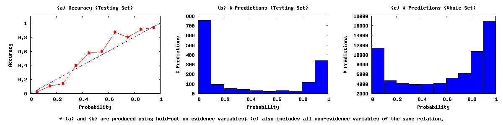

# Example Application: A Mention-Level Extraction System

This document describes how to **build an application to extract mention-level
marriage (`has_spouse`) relation between two people from text** in DeepDive.

This document assumes you are familiar with basic concepts in DeepDive and in
[Knowledge Base Construction](../../general/kbc.html). Please refer to other
[documents](../../../index.html#documentation) to learn more about these topics.

## <a name="high_level_picture" href="#"> </a> High-level picture of the application

This tutorial shows how to build a full DeepDive application that extracts
**mention-level** `has_spouse` (i.e., marriage) relationships from raw text. We
use news articles as the input data and we want to extract all pairs of people
that participate in a `has_spouse` relation, for example *Barack Obama* and
*Michelle Obama*. This example can be easily translated into an application for
relation extraction in other domains, such as interactions between drugs, or
relationships among companies.

<a name="dataflow" href="#"> </a>

At a high level, we will go through the following steps:

1. Data preprocessing and loading
2. Candidate generation and Feature extraction:
  - Extract mentions of people in the text
  - Extract all candidate pairs of people that possibly participate in a
    `has_spouse` relation and prepare training data by
    [distant supervision](../../general/relation_extraction.html)
    using an existing knowledge base
  - Add features to `has_spouse` candidates
3. Generate the factor graph as specified by inference rules
4. Perform statistical learning and inference and generate the results

<!--
We will use `tsv_extractors` for our
extractors. A similar example application with implementations for the
[different types of extractors](../extractors.html) is available under
`$DEEPDIVE_HOME/examples/spouse_example`.
-->

This tutorial assumes that you [installed DeepDive](../installation.html). The
installation directory of DeepDive is denoted as`$DEEPDIVE_HOME`. The database
system used for this tutorial is PostgreSQL. If you followed the [DeepDive
installation guide](../installation.html) and all tests completed successfully,
then your PostgreSQL server should already be running.
You can run the following command to set the correct path for `DEEPDIVE_HOME` if you're at the top of DeepDive's source tree:

```bash
DEEPDIVE_HOME=$PWD
```

The application we develop in this and the following sections of the
tutorial is also available in the directory
`$DEEPDIVE_HOME/examples/tutorial_example` in three parts.
The complete example code is in `$DEEPDIVE_HOME/examples/spouse_example`.


### Contents

* [Preparation](#preparation)
* [Implement the data flow](#implement_dataflow)
  1. [Data preprocessing](#loading_data)
  2. [Candidate generation and Feature extraction](#feature_extraction)
      - [Adding a people extractor](#people_extractor)
      - [Extracting and supervising candidate relations](#candidate_relations)
      - [Adding features to candidate relations](#candidate_relation_features)
  3. [Writing inference rules and defining holdout](#inference_rules)
  4. [Run and Get results](#get_result)

Other sections:

- [How to examine / improve results](walkthrough-improve.html)
- [Extras: preprocessing, NLP, pipelines, debugging
  extractor](walkthrough-extras.html)

## <a name="preparation" href="#"></a> Preparation

A DeepDive application is a filesystem directory that contains the following files and directories:

* `deepdive.conf`
* `db.url`
* `schema.sql`
* `input/`
* `udf/`

In this section, we will create each of them either from scratch or by copying from the template.
You can find more detail from the page about the [structure of a DeepDive app](../../advanced/deepdiveapp.html).

### Application Directory
First, we create a new directory `app/spouse` for our application under the DeepDive source tree.
In fact, the application can be created anywhere you want.

```bash
cd $DEEPDIVE_HOME
mkdir -p app/spouse   # makes sure the path exists
```

From now on we will assume the current working directory is this application directory we just created.

```bash
cd app/spouse
```

### DeepDive Configuration
DeepDive's main input is the `deepdive.conf` file that contains all the information necessary for running an application, e.g., extractor specification, inference rules, pipelines, and so on.
A skeleton `deepdive.conf` included in DeepDive's source tree can be copied into this application:

```bash
cp $DEEPDIVE_HOME/examples/template/deepdive.conf ./
```

### Database Configuration
Next, the `db.url` file contains the database connection settings represented as a URL for the application.
Since we are assuming a local PostgreSQL installation, a simple URL can be used as follows:

```bash
echo postgresql://localhost/deepdive_spouse >./db.url
```

The `schema.sql` file should contain all `CREATE TABLE` SQL statements necessary for creating the tables that hold the input data as well as the data we extract with DeepDive.
We can copy this one from DeepDive's source tree using the command below.
For a detailed reference of how these tables should be created, refer to the [Preparing the Data Tables section](walkthrough-extras.html#data_tables) in the appendix.

```bash
cp $DEEPDIVE_HOME/examples/tutorial_example/step1-basic/schema.sql ./
```

Now, DeepDive will initialize the database for us if we run the following command:

```bash
deepdive initdb
```

You can check that the data have been successfully loaded with the command below.
Note that the `deepdive sql` command executes a given SQL query against the database configured in `db.url`.

```bash
deepdive sql '\d+'
```

The output should look like the following:

```
                            List of relations
 Schema |        Name         | Type  | Owner |    Size    | Description
--------+---------------------+-------+-------+------------+-------------
 public | has_spouse          | table | user  | 8192 bytes |
 public | has_spouse_features | table | user  | 8192 bytes |
 public | people_mentions     | table | user  | 8192 bytes |
 public | sentences           | table | user  | 8192 bytes |
(4 rows)
```

Now, we're all set to start filling in more detail to this new application.


## <a name="implement_dataflow" href="#"></a> Implement the Data Flow

Let's now implement the [data flow](#dataflow) for this KBC application.

### <a name="loading_data" href="#"></a> Step 1: Data preprocessing and loading

For any DeepDive application, there's a set of input data from which we want to extract the information of our interest.
For example, in this tutorial the text corpus of news articles and a set of known interpersonal relationships are the input data.
Instead of starting from the raw text, we'll assume the corpus has been already preprocessed with an NLP (Natural Language Processing) toolkit, and consider the input as a set of sentences parsed and tagged with NLP markups.
If you have your own text corpus and need to start from raw text, you should perform NLP steps on the corpus before continuing to the rest of the data flow.
Refer to the [nlp_extractor section of this tutorial](walkthrough-extras.html#nlp_extractor) to find out how NLP can be done within DeepDive.

#### Input Data
We made a sample input dataset for this tutorial available online.
Let's download that dataset to the right place into our new application:

```bash
mkdir -p ./input
( cd ./input
  curl -RLO http://i.stanford.edu/hazy/deepdive-tutorial-data.zip
  unzip deepdive-tutorial-data.zip
)
```

Now the `input/` directory under your application should contain the following files:

* `non-spouses.tsv`
* `sentences_dump.csv`
* `sentences_dump_large.csv`
* `spouses.tsv`


#### Loading into Database

Next, we should load these input data into the database.
We can use a simple `COPY FROM` SQL query, as follows:

```bash
deepdive sql "COPY sentences FROM STDIN CSV" <./input/sentences_dump.csv
```

This populates the `sentences` table.
You can check that the data have been successfully loaded with the following command:

```bash
deepdive sql '\d+'
```

The output should look like the following:

```
                            List of relations
 Schema |        Name         | Type  | Owner |    Size    | Description
--------+---------------------+-------+-------+------------+-------------
 public | has_spouse          | table | user  | 8192 bytes |
 public | has_spouse_features | table | user  | 8192 bytes |
 public | people_mentions     | table | user  | 8192 bytes |
 public | sentences           | table | user  | 90 MB      |
(4 rows)
```

- The `sentences` table now holds the sentences preprocessed by an [NLP extractor](walkthrough-extras.html#nlp_extractor).
    It contains tokenized words, lemmatized words, part of speech (POS) tags, named entity recognition (NER) tags, and dependency paths for each sentence.
- Other tables are currently empty, and will be populated during the candidate generation and the feature extraction steps in the following sections.


#### Input Initialization Script

In general, any input data for the DeepDive application should be kept under `input/`.
An executable shell script at `input/init.sh` can handle any extra steps for preparing such data as well as the actual loading into the database.
The `deepdive initdb` command we ran in the previous section will execute this script when available.

The manual steps we performed above should be recorded in the `input/init.sh` script, so they're done automatically every time we initialize the database.
For now, let's copy to our application a complete script included in DeepDive's source tree:

```bash
cp $DEEPDIVE_HOME/examples/tutorial_example/step1-basic/input/init.sh ./input/
```


### <a name="feature_extraction" href="#"></a> Step 2: Candidate Generation and Feature Extraction

Our next step is to write several [extractors](../extractors.html) for candidate
generation and feature extraction.

In this step, we create three extractors in Python. The Python
scripts will go through each sentence in the corpus and respectively:

1. create mentions of people;
2. create candidate pairs of people mentions that may be in a marriage relation,
        and supervise some of them using distant supervision rules;
3. add features to the candidates, which will be used by DeepDive to learn how
        to distinguish between correct marriage relation mentions and incorrect
        ones;

#### <a name="people_extractor" href="#"></a> Adding a people extractor

We first need to recognize the persons mentioned in a sentence. Given a
set of sentences, the person mention extractor will populate a relation
`people_mention` that contains an encoding of the mentions. In this example, we
build a simple person recognizer that simply uses the NER tags created by the
NLP toolkit. We could do something more sophisticated, but in this tutorial we
just want to illustrate the basic concepts of KBC building.

**Input:** sentences along with NER tags. Specifically, each line in the input to
this extractor is a row from the `sentences` table in a special TSV (Tab
Separated Values) format, where the arrays have been transformed into strings
with elements separated by `~^~`, e.g.:

    118238@10       Sen.~^~Barack~^~Obama~^~and~^~his~^~wife~^~,~^~Michelle~^~Obama~^~,~^~have~^~released~^~eight~^~years~^~of~^~joint~^~returns~^~.        O~^~PERSON~^~PERSON~^~O~^~O~^~O~^~O~^~PERSON~^~PERSON~^~O~^~O~^~O~^~DURATION~^~DURATION~^~O~^~O~^~O~^~O

**Output:** TSV lines that can be loaded as rows of the `people_mentions` table, e.g.:

    118238@10   1       2       Barack Obama    118238@10_1
    118238@10   7       2       Michelle Obama  118238@10_7

This first extractor identifies people mentions (in the above sample ,
"Barack Obama" and "Michelle Obama") in the sentences, and insert them into the table
`people_mentions`.  We use the named entity tags from the `ner_tags` column of
the `sentences` table to identify word phrases that have all words tagged as
`PERSON`.

To define our extractors in DeepDive, we start by adding several lines
into the `deepdive.extraction.extractors` block in `deepdive.conf`, which
should already be present in the template:

<script src="http://gist-it.appspot.com/https://github.com/HazyResearch/deepdive/blob/master/examples/tutorial_example/step1-basic/deepdive.conf?footer=minimal&slice=17:57"></script>

Note that we first create an extractor `ext_clear_table`, which is executed
before any other extractor and empties the output tables of all other
extractors. This is a `sql_extractor`, which is just a set of SQL
commands specified in the `sql` field.

For our person mention extractor `ext_people`, the meaning of each line is the
following:

1. The style of the extractor is a `tsv_extractor`.

2. The input to the `ext_people` extractor is the output of the given SQL query,
which selects all rows from the `sentences` table, projecting on the columns
`sentence_id`, `words`, and `ner_tags`. These last two columns are arrays that
are converted to strings with the elements separated by `~^~` (this is to ease
the parsing by the extractor, as the TSV format for arrays is not
straightforward to parse)

3. The output of the extractor will be written to the `people_mentions` table
(for the table format, refer to the [cheat-sheet](#table_cheatsheet) in the
appendix).

4. The extractor script is `udf/ext_people.py`. DeepDive launches this
command, stream rows returned by the input query to the *stdin* of the process,
reads output lines from *stdout* of the process, and loads these lines into the
`people_mentions` table.

5. The `dependencies` field specifies that this extractor can be executed only
after the `ext_clear_table` extractor has completed.

For additional information about extractors, refer to the ['Writing extractors'
guide](../extractors.html).

We then create a `udf` directory to store the scripts:

```bash
mkdir ./udf
```

Then we create a `udf/ext_people.py` script which acts as UDF for the people
mention extractor. The script scans input sentences and outputs phrases
representing mentions of people. The script should contain the following code:

(a copy of this script is also available from
`$DEEPDIVE_HOME/examples/tutorial_example/step1-basic/udf/ext_people.py`):

<script src="http://gist-it.appspot.com/https://github.com/HazyResearch/deepdive/blob/master/examples/tutorial_example/step1-basic/udf/ext_people.py?footer=minimal"></script>

This `udf/ext_people.py` Python script takes sentence records as input, and
outputs a people mention record for each set of one or more continuous words
with NER tag `PERSON` in the sentence.
To get a sample of the inputs to the extractor, refer to [getting example
inputs](walkthrough-extras.html#debug_extractors) section in the Extras.
To add debug output, you can print to *stderr* instead of stdout, and the
messages would appear on the terminal, as well as in the DeepDive log file
(`run/LATEST/log.txt`).

You can now run the extractor by executing `deepdive run`. Once the run has
completed, you should be able to see the extracted results in the
`people_mentions` table. We select the results of the sample input data to see
what happens in the extractor:

```bash
deepdive run    # Run extractors now
deepdive sql "SELECT * FROM people_mentions WHERE sentence_id='118238@10'"
```

The results will look like:

     sentence_id | start_position | length |      text      | mention_id
    -------------+----------------+--------+----------------+-------------
     118238@10   |              1 |      2 | Barack Obama   | 118238@10_1
     118238@10   |              7 |      2 | Michelle Obama | 118238@10_7
    (2 rows)


To double-check that the results you obtained are correct, count the number of
tuples in your tables:

```bash
deepdive sql "SELECT COUNT(*) FROM sentences"
deepdive sql "SELECT COUNT(*) FROM people_mentions"
```

The results should look like:

```
 count
-------
 55469
```

and

```
 count
-------
 88266
```

#### <a name="candidate_relations" href="#"></a> Extracting candidate relations between mention pairs

Now we need to create candidates for `has_spouse` relations. For
simplicity, a relation candidate is a **pair of person mentions in the same
sentence**.

In order to train the system to decide whether a candidate is indeed expressing
a marriage relation, we also need to generate some *training data*. However, it
is hard to find ground truth on whether two mentions participate in `has_spouse`
relation. Therefore, we use [distant
supervision](../../general/distant_supervision.html) rules that generate
mention-level training data by heuristically mapping them to known entity-level
relations in an existing knowledge base.

The extractor we are now going to write takes all mentions of people in a
sentence, and insert each pair of them into the table `has_spouse`, while also
adding labeling some of these pairs as `true` or `false` according to the
supervision rules.

**Input:** two mentions from the `people_mentions` table coming from the same
sentence, e.g.:

    118238@10   118238@10_7     Michelle Obama  118238@10_1     Barack Obama

**Output:** one row in `has_spouse` table:

    118238@10_7 118238@10_1     118238@10       Michelle Obama-Barack Obama     t       118238@10_7-118238@10_1 247956


To understand how DeepDive works, we should look at the schema of the
`has_spouse` table:

         Table "public.has_spouse"
       Column    |  Type   | Modifiers
    -------------+---------+-----------
     person1_id  | bigint  |            # first person's mention_id in people_mentions
     person2_id  | bigint  |            # second person's mention_id
     sentence_id | bigint  |            # which senence it appears
     description | text    |            # a description of this relation pair
     is_true     | boolean |            # whether this relation is correct
     relation_id | bigint  |            # unique identifier for has_spouse
     id          | bigint  |            # reserved for DeepDive


The table `has_spouse` contains `is_true` column. We need this column because we
want DeepDive to predict how likely it is that a given entry in the table is
correct. Each row in the `has_spouse` table will be assigned a random variable
for its `is_true` column, representing whether the corresponding relation
candidate is expressing a marriage relation or not. DeepDive will predict the
probability of this Boolean random variable to be `true`.

Also note that we must reserve another special column, `id`, of type `bigint`,
in any table containing variables. This column should be **left
blank, and not be used anywhere** in your application. We will further see
inference rule syntax requirements related to the `id` column.

We now tell DeepDive to create variables for the `is_true` column of the
`has_spouse` table for probabilistic inference, by adding the following line
to the `schema.variables` block in `deepdive.conf`:

<script src="http://gist-it.appspot.com/https://github.com/HazyResearch/deepdive/blob/master/examples/tutorial_example/step1-basic/deepdive.conf?footer=minimal&slice=12:17"></script>

We now define an extractor that creates all candidate relations and inserts them
into the table `has_spouse`. We call them *candidate relations* because we do
not know  whether or not they are actually expressing a marriage relation:
that's for DeepDive to predict later. Add the following to `deepdive.conf` to
define the extractor:

<script src="http://gist-it.appspot.com/https://github.com/HazyResearch/deepdive/blob/master/examples/tutorial_example/step1-basic/deepdive.conf?footer=minimal&slice=57:83"></script>

Note that this extractor must be executed after our previously added extractor
`ext_people`, so we specify the latter in the `dependencies` field.

When generating relation candidates, we also generate training data using
[distant supervision](../../general/distant_supervision.html). There are some
pairs of people that we know for sure are married, and we can use them as
training data for DeepDive. Similarly, if we know that two people are not
married, we can use them as negative training examples. In our case we will be
using data from [Freebase](http://www.freebase.com/) for distant supervision,
and use exact string matching to map mentions to entities.

To generate positive examples, we have exported all pairs of people with a
`has_spouse` relationship from the [Freebase data
dump](https://developers.google.com/freebase/data) and included them in a TSV
file `input/spouses.tsv`, which should have been downloaded in
[Preparation section](#preparation).

To generate negative examples, we use the following heuristics:

1. A pair of persons who are in some kind of relation that is incompatible with
a marriage relation can be treated as a negative example: if, for example, A is
B's parent / children / sibling, then A is not likely to be married to B. We
include a TSV file in `input/non-spouses.tsv` containing such relations sampled
from Freebase, which should have been downloaded in the archive.

2. A pair of the same person is a negative example of `has_spouse` relations,
e.g., "Barack Obama" cannot be married to "Barack Obama".

3. If the existing knowledge base of married couples (the `input/spouses.tsv`
file) contains the fact that person A is married to person B and person C is
married to person D, then it is unlikely that person A is married to person C.

These supervision rules expose a typical property of distant supervision rules:
they may be not perfect, in the sense that we may mislabel some relation
candidates. This is not an issue: as long as a sufficient majority of the
supervised candidates are correctly supervised, the system will be able to
extract the information even if the signal given by the distant supervision is,
in some sense, "noisy". This is a desirable property, as it allows to use
distant supervision rules that are at least reasonable even if they are not
perfect.

We now create a script `udf/ext_has_spouse.py` to generate and label
the relation candidates:

<script src="http://gist-it.appspot.com/https://github.com/HazyResearch/deepdive/blob/master/examples/tutorial_example/step1-basic/udf/ext_has_spouse.py?footer=minimal"></script>

We can now run the system by executing `deepdive run` and check
the output relation `has_spouse`. `deepdive run` will run the full pipeline with all
extractors. If you only want to run the new
extractor, refer to the [Pipeline section](walkthrough-extras.html#pipelines) in the appendix.

We can look at some relation candidate generated by the `ext_has_spouse`
extractor:

```bash
deepdive run
deepdive sql "SELECT * FROM has_spouse WHERE person1_id='118238@10_7'"
```

The results will look like the following:

     person1_id  | person2_id  | sentence_id |         description         | is_true |       relation_id       |  id
    -------------+-------------+-------------+-----------------------------+---------+-------------------------+-------
     118238@10_7 | 118238@10_1 | 118238@10   | Michelle Obama-Barack Obama | t       | 118238@10_7-118238@10_1 |

To check that your results are correct, you can count the number of tuples in
the table:

```bash
deepdive sql "SELECT is_true, COUNT(*) FROM has_spouse GROUP BY is_true"
```

The results should be:

```
 is_true | count
---------+--------
         | 178426
 t       |  23570
 f       |  83344
```

#### <a name="candidate_relation_features" href="#"></a> Adding Features for candidate relations

In order for DeepDive to make predictions, we need to add *features* to our
candidate relations. Features are properties of the candidate that are used by
the system to decide whether or not the candidate is expressing a marriage
relation. For now, we use intuitive features, but this will lead to low quality
results which we will improve later. We now write an extractor that computes
features from the relation candidates and the sentences they come from.

The features we use are:

1. the bag of words between the two mentions;

2. the number of words between two phases;

3. whether the last word of the two persons' name (last name) is the same.

We will refine these features [later](walkthrough-improve.html).

For this new extractor:

**Input:** a mention pair as well as all words in the sentence it appears. e.g.:

    Sen.~^~Barack~^~Obama~^~and~^~his~^~wife~^~,~^~Michelle~^~Obama~^~,~^~have~^~released~^~eight~^~years~^~of~^~joint~^~returns~^~.    118238@10_7-118238@10_1 7       2       1       2

**Output:** all features for this mention pair described above:

    118238@10_1_118238@10_7     "word_between=,"
    118238@10_1_118238@10_7     "word_between=his"
    118238@10_1_118238@10_7     "potential_last_name_match"
    118238@10_1_118238@10_7     "word_between=wife"
    118238@10_1_118238@10_7     "num_words_between=4"
    118238@10_1_118238@10_7     "word_between=and"

Create a new extractor for features, which will execute after the
`ext_has_spouse_candidates` extractor:

<script src="http://gist-it.appspot.com/https://github.com/HazyResearch/deepdive/blob/master/examples/tutorial_example/step1-basic/deepdive.conf?footer=minimal&slice=82:107"></script>

To create our extractor UDF, we make use of `ddlib`, our Python library that
provides useful utilities such as `Span` to manipulate elements in sentences.
Make sure you followed the [installation guide](../installation.html#ddlib) to
properly use `ddlib`.

Create the script `udf/ext_has_spouse_features.py` with the following content:

(a copy of this script is also available from
`$DEEPDIVE_HOME/examples/tutorial_example/step1-basic/udf/ext_has_spouse_features.py`)

<script src="http://gist-it.appspot.com/https://github.com/HazyResearch/deepdive/blob/master/examples/tutorial_example/step1-basic/udf/ext_has_spouse_features.py?footer=minimal"></script>

As before, you can run the system by executing `deepdive run` and check the output
relation `has_spouse_features`:

```bash
deepdive run
deepdive sql "SELECT * FROM has_spouse_features WHERE relation_id = '118238@10_1-118238@10_7'"
```

The results would look like the following:

```
       relation_id       |          feature
-------------------------+---------------------------
 118238@10_1-118238@10_7 | word_between=,
 118238@10_1-118238@10_7 | word_between=his
 118238@10_1-118238@10_7 | potential_last_name_match
 118238@10_1-118238@10_7 | word_between=wife
 118238@10_1-118238@10_7 | num_words_between=4
 118238@10_1-118238@10_7 | word_between=and
(6 rows)
```

Again, you can count the number of tuples in the table:

```bash
deepdive sql "SELECT COUNT(*) FROM has_spouse_features"
```

The results should look like:

```
  count
---------
 3805294
```

### <a name="inference_rules" href="#"></a> Step 3: Writing inference rules and defining holdout

Now we need to specify how DeepDive should generate the [factor
graph](../../general/inference.html) to perform probabilistic learning and inference.
We want to predict the `is_true` column of the `has_spouse` table based on the
features we have extracted, by assigning to each feature a weight that DeepDive
will learn from the training data. This is one of the simplest inference rules
one can write in DeepDive, as it does not involve any domain knowledge or
relationship among different random variables.

Add the following lines to your `deepdive.conf`, in the `inference.factors` block:

<script src="http://gist-it.appspot.com/https://github.com/HazyResearch/deepdive/blob/master/examples/tutorial_example/step1-basic/deepdive.conf?footer=minimal&slice=109:141"></script>

This rule generates a model similar to a logistic regression classifier: it uses
a set of features to make a prediction about the expectation of the variable we
are interested in. For each row in the *input query* we are creating a
[factor](../../general/inference.html) that is connected to the
`has_spouse.is_true` variable and whose weight is learned by DeepDive on the
basis of the `feature` column value (i.e., of the features).

Note that the syntax requires the users to **explicitly select** in the `input_query`:

1. The `id` column for each variable
2. The variable column, which is `is_true` in this case
3. The column the weight depends on (if any), which is `feature` in this case

When selecting these column, users must explicitly alias `id` to
`[relation_name].id` and `[variable]` to `[relation_name].[variable]` in order
for the system to use them. For additional information, refer to the [inference
rule guide](../inference_rules.html).

Now that we have defined inference rules, DeepDive will automatically
[ground](../overview.html#grounding) the factor graph using these rules, then
perform the learning to figure out the feature weights, and the inference to
compute the probabilities to associate to candidate relations.

We are almost ready to do our first complete run! In order to evaluate our
results, we also want to define a *holdout fraction* for our predictions. The
holdout fraction defines how much of our training data we want to treat as
testing data used to compare our predictions against. By default the holdout
fraction is `0`, which means that we cannot evaluate the precision of our
results. One may add a line `calibration.holdout_fraction: 0.25`
to `deepdive.conf` to holdout one quarter of the training data randomly,
but in our application, we instead specify a custom holdout SQL query which selects
the column `id` of some random rows from the `has_spouse` mention table and
add them into the table `dd_graph_variables_holdout`.
Let's add it to `deepdive.conf`:

<script src="http://gist-it.appspot.com/https://github.com/HazyResearch/deepdive/blob/master/examples/tutorial_example/step1-basic/deepdive.conf?footer=minimal&slice=153:168"></script>

At this point, the setup of the application is complete. Note that you can find
all extractors, scripts, and the complete `deepdive.conf` file that we wrote
until now in the `$DEEPDIVE_HOME/examples/tutorial_example/step1-basic/`
directory.

### <a name="get_result" href="#"> </a> Step 4: Running and getting results

We can now run the application again

```bash
deepdive run
```

After running, you should see a summary report similar to:

    16:51:37 [profiler] INFO  --------------------------------------------------
    16:51:37 [profiler] INFO  Summary Report
    16:51:37 [profiler] INFO  --------------------------------------------------
    16:51:37 [profiler] INFO  ext_clear_table SUCCESS [330 ms]
    16:51:37 [profiler] INFO  ext_people SUCCESS [40792 ms]
    16:51:37 [profiler] INFO  ext_has_spouse_candidates SUCCESS [17194 ms]
    16:51:37 [profiler] INFO  ext_has_spouse_features SUCCESS [189242 ms]
    16:51:37 [profiler] INFO  inference_grounding SUCCESS [3881 ms]
    16:51:37 [profiler] INFO  inference SUCCESS [13366 ms]
    16:51:37 [profiler] INFO  calibration plot written to /YOUR/PATH/TO/APP/run/DATE/TIME/calibration/has_spouse.is_true.png [0 ms]
    16:51:37 [profiler] INFO  calibration SUCCESS [920 ms]
    16:51:37 [profiler] INFO  --------------------------------------------------


DeepDive creates a view `has_spouse_is_true_inference` that contains one row for
each variable for which it predicted the value. The schema of the view is the
same as the `has_spouse` table, with an additional `expectation` column
containing the predicted probability for the corresponding variable. We can run
the following query to sample some high-confidence mention-level relations and
the sentences they come from:

```bash
deepdive sql "
  SELECT s.sentence_id, description, is_true, expectation, s.sentence
  FROM has_spouse_is_true_inference hsi, sentences s
  WHERE s.sentence_id = hsi.sentence_id and expectation > 0.9
  ORDER BY random() LIMIT 5
"
```

The result should look like the following (might not be the same because of random sampling):

```
 sentence_id |       description        | is_true | expectation | sentence
-------------+--------------------------+---------+-------------+----------
 154431@0    | Al Austin-Akshay Desai   |         |       0.972 | Guest list Jeff Atwater , Senate president Al Austin , Republican fundraiser from Tampa St. Petersburg Mayor Rick Ba
ker and wife , Joyce , St. Petersburg Brian Ballard , former chief of staff for Gov. Bob Martinez and a campaign adviser to Crist Rodney Barreto , a Crist fundraiser Ron Book , South
 Florida lobbyist Charlie Bronson , agriculture commissioner Dean Colson , a Miami lawyer and adviser to the governor on higher education issues Dr. Akshay Desai , head of Universal
Health Care Insurance in St. Petersburg Eric Eikenberg , Crist 's chief of staff Fazal Fazlin , entrepreneur -LRB- held fundraisers for Crist during the gubernatorial campaign -RRB-
, St. Petersburg .
 148797@53   | Michael-Carole Shelley   |         |       0.954 | WITH : Haydn Gwynne -LRB- Mrs. Wilkinson -RRB- , Gregory Jbara -LRB- Dad -RRB- , Carole Shelley -LRB- Grandma -RRB-
and Santino Fontana -LRB- Tony -RRB- , David Bologna and Frank Dolce -LRB- Michael -RRB- , and David Alvarez , Trent Kowalik and Kiril Kulish -LRB- Billy -RRB- .
 58364@10    | John-Jack Edwards        |         |       0.944 | This year , John and Jack Edwards are far from the only parent and child negotiating the awkward intersection of fam
ily and campaign life .
 40427@30    | James Taylor-Carly Simon |         |       0.962 | Look at James Taylor and Carly Simon , Whitney Houston and Bobby Brown or Britney Spears and Kevin Federline -LRB- y
es , calling him a musician is a stretch -RRB- .
 23278@18    | Chazz-Josh Gordon        |         |       0.944 | Directors Josh Gordon and Will Speck even discover an original way of hitting Chazz and Jimmy below the belt simulta
neously .
(5 rows)
```

We see that the results do not seem very good, but we will improve them in the
next section.

Before that, let us mention the fact that  DeepDive generates [calibration
plots](../calibration.html) for all variables defined in the schema to help with
debugging. Let's take a look at the generated calibration plot, written to the
file outputted in the summary report above (has_spouse.is_true.png). It should
look something like this:



The calibration plots contain useful information that help you to improve the
quality of your predictions. For actionable advice about interpreting
calibration plots, refer to the [calibration guide](../calibration.html).

In the [next section](walkthrough-improve.html), we will discuss several ways to
analyze and improve the quality of our application.

