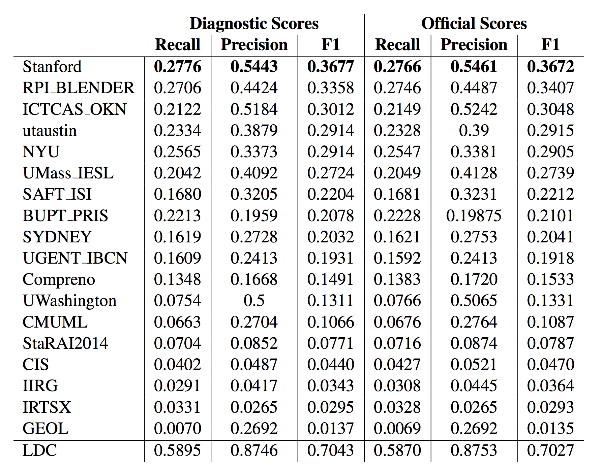

## DeepDive Applications

Here are a list of notable public DeepDive applications.

<ul>
<li><a class="c3" href="#tac-kbp">TAC-KBP Challenge</a></li>
<li><a class="c3" href="#wisci">Wisci(-pedia)</a></li>
<li><a class="c3" href="#geo-paleo">Geology and Paleontology</a></li>
<li><a class="c3" href="#memex">Memex / Human trafficking</a></li>
<li><a class="c3" href="#genetics">Medical Genetics</a></li>
</ul>

<h3 class="c0">
TAC-KBP Challenge
</h3>

TAC-KBP (Text Analysis Conference, Knowledge Base Population track, organized by NIST) is a research competition where the task is to extract common properties of people and organizations (e.g., age, birthplace, spouses, and shareholders) from a few million of newswire and web documents -- this task is also termed <a class="c3" href="http://surdeanu.info/kbp2014/KBP2014_TaskDefinition_EnglishSlotFilling_1.1.pdf">Slot Filling</a>. In the 2014 evaluation, 31 US and international teams participated in the competition, including <a class="c3" href="http://i.stanford.edu/hazy/papers/2014kbp-systemdescription.pdf">a solution based on DeepDive</a>&nbsp;from Stanford. The DeepDive based solution achieved <a class="c3" href="http://nlp.cs.rpi.edu/paper/sf2014overview.pdf">the highest precision, recall, and F1</a>&nbsp;among all submissions.

<h3 class="c0">
Wisci(-pedia)
</h3>

Wisci is a first incarnation of the &ldquo;<a class="c3" href="https://www.youtube.com/watch?v=Q1IpE9_pBu4">encyclopedia built by the machines, for the people</a>&rdquo; vision. (It was developed by the Hazy research group when the team was at University of Wisconsin-Madison. Hence the project name.) We applied similar techniques as our solution to the TAC-KBP challenge -- namely <a class="c3" href="http://www.cs.stanford.edu/people/chrismre/papers/deepdive_vlds.pdf">NLP, distant supervision, and probabilistic inference</a>&nbsp;-- over the ClueWeb09 corpus that contains 500 million web pages. The extraction and inference results include millions of common properties of people and organizations, as well as confidence scores and provenance. They are used to augment a Wikipedia mirror, where we supplement human-authored page content and infoboxes with related facts, references, excerpts, and videos discovered by DeepDive. Wisci also accepts user feedback and learns from it.

<h3 class="c0">
Geology and Paleontology
</h3>

<a class="c3" href="http://en.wikipedia.org/wiki/Geology">Geology</a>&nbsp;studies history of the solid Earth; <a class="c3" href="http://en.wikipedia.org/wiki/Paleontology">paleontology</a>&nbsp;studies&nbsp;fossils and ancient organisms. At the core of both disciplines are discovery and knowledge sharing. In particular, the research communities have maintained two live databases: <a class="c3" href="http://macrostrat.org/about.php">Macrostrat</a>, which contains tens of thousands of rock units and their attributes, and the <a class="c3" href="https://paleobiodb.org/#/">Paleobiology Database</a>&nbsp;(PBDB), which contains hundreds of thousands of taxonomic names and their attributes. However, both projects require researchers to laboriously sift through massive amounts of scientific publications, find relevant statements, and manually enter them into the database. For example, PBDB has taken approximately nine continuous person years to read from roughly 40K documents in the past two decades.

In collaboration with <a class="c3" href="http://geoscience.wisc.edu/geoscience/people/faculty/shanan-peters/">Prof. Shanan Peters</a>&nbsp;at UW-Madison, we developed two DeepDive programs, <a class="c3" href="http://www.cs.stanford.edu/people/chrismre/papers/gdd_demo.pdf">GeoDeepDive</a>&nbsp;and <a class="c3" href="http://journals.plos.org/plosone/article?id=10.1371/journal.pone.0113523">PaleoDeepDive</a>, that process roughly 300K scientific documents (including text, tables, and figures). On the document set covered by both DeepDive and PBDB contributors (12K), DeepDive achieves recall roughly 2.5X that of humans, and precision that is as high as or higher than humans.

<h3 class="c0">
Memex / Human trafficking
</h3>

<a class="c3" href="http://www.darpa.mil/newsevents/releases/2014/02/09.aspx">Memex</a>&nbsp;is a DARPA program to explore next-generation domain-specific information retrieval systems. As an ongoing application, the federal government has been using the Memex technology to <a class="c3" href="http://www.cbsnews.com/news/new-search-engine-exposes-the-dark-web/">fight human trafficking</a>. For this application, the input is a portion of the dark web where human traffickers are likely to (surreptitiously) post supply and demand information about illegal labor, involuntary sex workers, etc. DeepDive would process the web documents to extract evidential data such as names, addresses, phone numbers, job types, job requirements, etc. Together with provenance information, such evidential data are then passed on to other collaborators on the Memex program as well as law enforcement for structured analysis and consumption by operational applications. This application has been <a class="c3" href="http://www.scientificamerican.com/article/human-traffickers-caught-on-hidden-internet/">featured</a>&nbsp;<a class="c3" href="http://www.wsj.com/articles/sleuthing-search-engine-even-better-than-google-1423703464">extensively</a>&nbsp;<a class="c3" href="http://www.wired.com/2015/02/darpa-memex-dark-web/">in</a>&nbsp;<a class="c3" href="http://www.bbc.com/news/technology-31808104">the</a>&nbsp;<a class="c3" href="http://www.defenseone.com/technology/2015/02/darpas-new-search-engine-puts-google-dust/105342">media</a>. It is supporting <a class="c3" href="http://www.defenseone.com/technology/2015/02/darpas-new-search-engine-puts-google-dust/105342/">actual investigations</a>. [Link to <a class="c3" href="memex.html">Mike&rsquo;s article</a>.]

<h3 class="c0">
Medical Genetics
</h3>

The body of literature in life sciences has been <a class="c3" href="http://www.nlm.nih.gov/bsd/index_stats_comp.html">growing at accelerating speeds</a>&nbsp;to the extent that it has been unrealistic for scientists to perform research solely based on reading and memorization (even with the help of keyword search). As a result, there have been numerous initiatives to build structured knowledge bases from literature. For example, <a class="c3" href="http://omim.org/">OMIM</a>&nbsp;is an authoritative database of human genes and genetic disorders. It dates back to the 1960s, and so far contains about 6,000 hereditary diseases or phenotypes. Because OMIM is curated by humans, it has been growing at a rate of <a class="c3" href="http://omim.org/statistics/update">roughly 50 records / month for many years</a>. In collaboration with <a class="c3" href="http://bejerano.stanford.edu/pi.html">Prof. Gill Bejerano</a>&nbsp;at Stanford, we are developing DeepDive applications in the field of <a class="c3" href="http://en.wikipedia.org/wiki/Medical_genetics">medical genetics</a>. Specifically, we use DeepDive to extract mentions of genes, diseases, and phenotypes from the literature, and statistically infer their relationships.

