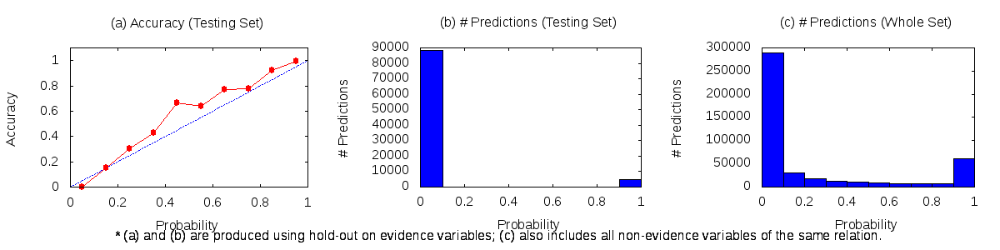
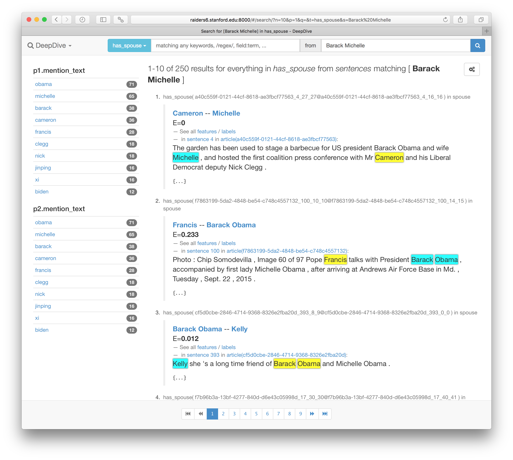
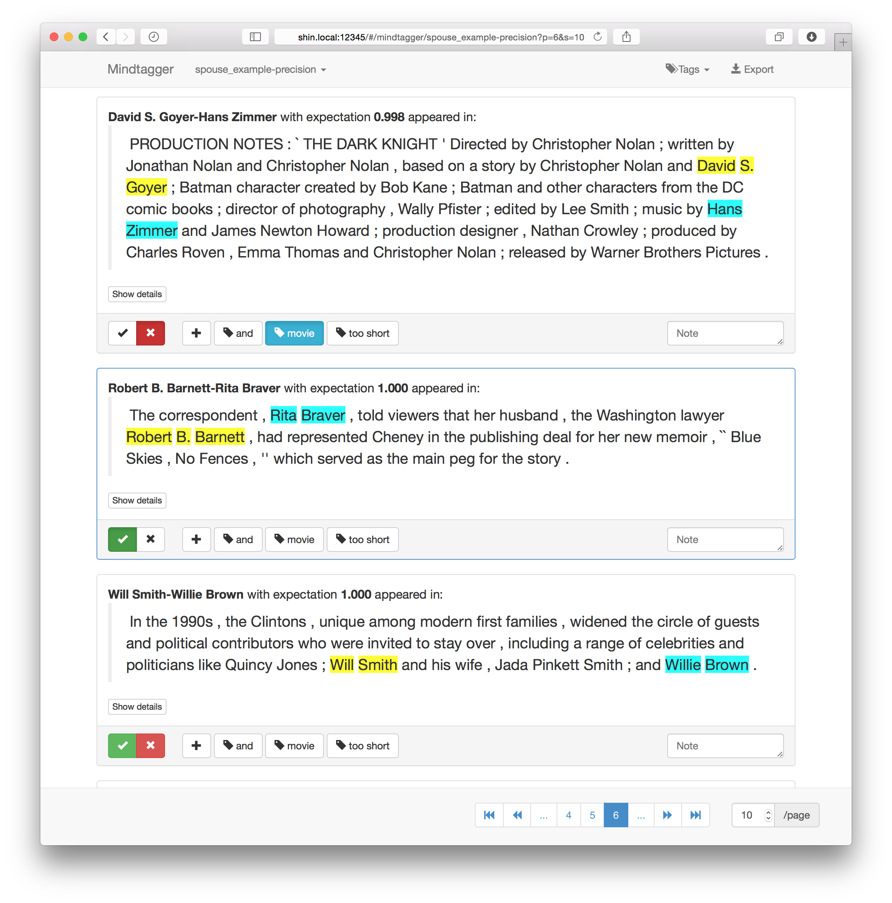
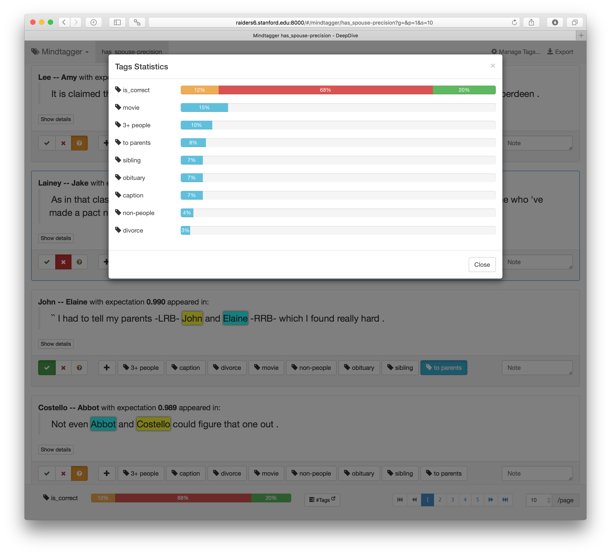
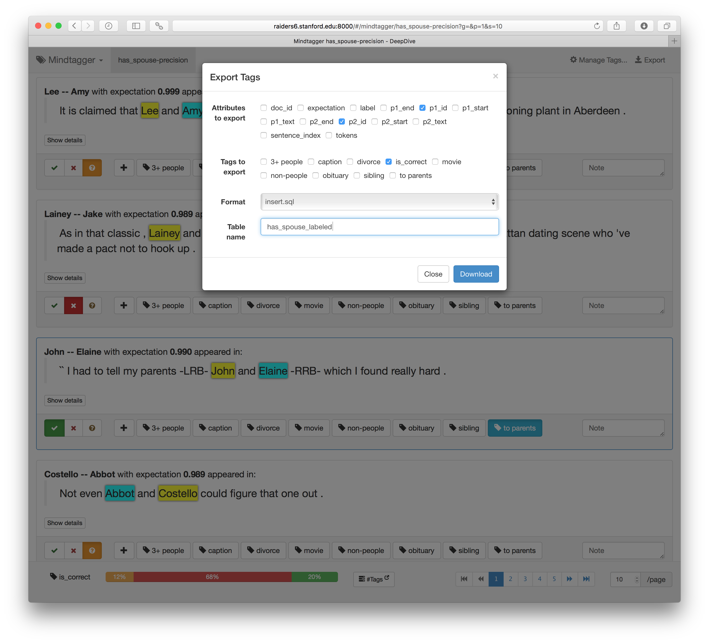
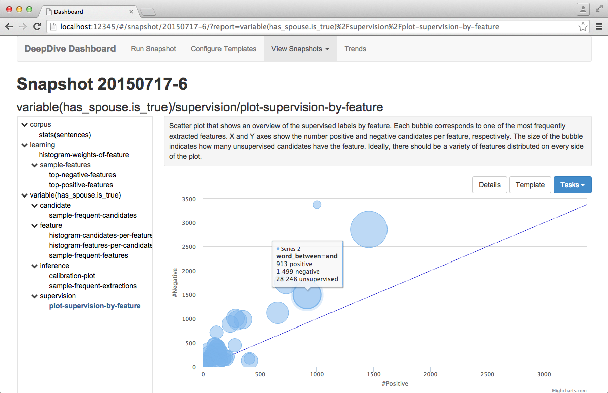
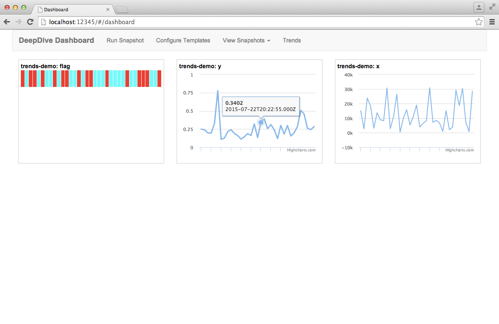

# DeepDive Tutorial <small>Extracting mentions of spouses from the news</small>

***NOTE: we recommend using the [Jupyter Notebook version of this tutorial](https://nbviewer.jupyter.org/github/HazyResearch/deepdive/blob/master/examples/spouse/DeepDive%20Tutorial%20-%20Extracting%20mentions%20of%20spouses%20from%20the%20news.ipynb) that can be [easily launched inside Docker containers](installation.md#launch-without-installing).***

In this tutorial, we show an example of a prototypical task that DeepDive is often applied to:
extraction of _structured information_ from _unstructured or 'dark' data_ such as web pages, text documents, images, etc.
While DeepDive can be used as a more general platform for statistical learning and data processing, most of the tooling described herein has been built for this type of use case, based on our experience of successfully applying DeepDive to [a variety of real-world problems of this type](showcase/apps.md).

In this setting, our goal is to take in a set of unstructured (and/or structured) inputs, and populate a relational database table with extracted outputs, along with marginal probabilities for each extraction representing DeepDive's confidence in the extraction.
More formally, we write a DeepDive application to extract mentions of _relations_ and their constituent _entities_ or _attributes_, according to a specified schema; this task is often referred to as **_relation extraction_**.*
Accordingly, we'll walk through an example scenario where we wish to extract mentions of two people being spouses from news articles.

The high-level steps we'll follow are:

1. **Data processing.** First, we'll load the raw corpus, add NLP markups, extract a set of _candidate_ relation mentions, and a sparse _feature_ representation of each.

2. **Distant supervision with data and rules.** Next, we'll use various strategies to provide _supervision_ for our dataset, so that we can use machine learning to learn the weights of a model.

3. **Learning and inference: model specification.** Then, we'll specify the high-level configuration of our _model_.

4. **Error analysis and debugging.** Finally, we'll show how to use DeepDive's labeling, error analysis and debugging tools.

*_Note the distinction between extraction of true, i.e., factual, relations and extraction of mentions of relations.
In this tutorial, we do the latter, however DeepDive supports further downstream methods for tackling the former task in a principled manner._


Whenever something isn't clear, you can always refer to [the complete example code at `examples/spouse/`](../examples/spouse/) that contains everything shown in this document.


## 0. Preparation
First of all, make sure that [DeepDive has been installed](installation.md).

Next, DeepDive will store all data—input, intermediate, output, etc.—in a relational database.
Currently, Postgres, Greenplum, and MySQL are supported; however, Greenplum or Postgres are strongly recommended.
To set the location of this database, we need to configure a URL in the [`db.url` file](../examples/spouse/db.url), e.g.:

```bash
echo "postgresql://$USER@$HOSTNAME:5432/deepdive_spouse_$USER" >db.url
```

_Note: DeepDive will drop and then create this database if run from scratch—beware of pointing to an existing populated one!_


## 1. Data processing

In this section, we'll generate the traditional inputs of a statistical learning-type problem: candidate spouse relations, represented by a set of features, which we will aim to classify as _actual_ relation mentions or not.

We'll do this in four basic steps:

1. Loading raw input data
2. Adding NLP markups
3. Extracting candidate relation mentions
4. Extracting features for each candidate

### 1.1. Loading raw input data
Our first task is to download and load the raw text of [a corpus of news articles provided by Signal Media](http://research.signalmedia.co/newsir16/signal-dataset.html) into an `articles` table in our database.
We create a simple shell script that downloads and outputs the news articles in TSV format.
DeepDive will automatically create the table, execute the script and load the table if we save it as:

```bash
input/articles.tsv.sh
```

The aforementioned script reads a sample of the corpus (provided as lines of JSON objects), and then using the [jq](https://stedolan.github.io/jq/) language extracts the fields `id` (for document id) and `content` from each entry and converts those to TSV format.

Next, we need to declare the schema of this `articles` table in [our `app.ddlog` file](../examples/spouse/app.ddlog); we add the following lines:

```ddlog
articles(
    id      text,
    content text
).
```

Then we compile our application, as we must do whenever we change `app.ddlog`:

```bash
deepdive compile
```

Finally, we tell DeepDive to execute the steps to load the `articles` table using the `input/articles.tsv.sh` script. You must have the [full corpus](http://research.signalmedia.co/newsir16/signal-dataset.html) downloaded.

```bash
deepdive do articles
```

Alternatively, a sample of 1000 articles can be loaded directly by issuing the following command:
```bash
deepdive load articles input/articles-1000.tsv.bz2
```

DeepDive will output an execution plan, which will pop up in your default text editor.
Save and exit to accept.
DeepDive will run, creating the table and then fetching and loading the data.

After that finishes, we can take a look at the loaded data using the following `deepdive query` command, which enumerates the values for the `id` column of the `articles` table:

```bash
deepdive query '?- articles(id, _).'
```

```
                  id
--------------------------------------
 340bb625-bb7e-49af-aa8d-781e5762f7a3
 fe4d045d-6c97-4ccf-a7d5-08aafb72a0db
 3585cd84-abd9-4f14-90ff-4fc23b45c84f
 eb571ae7-cd9f-4ad2-90a1-a74854574dc9
 6354c1a9-8f85-43c6-98d8-6b559d6727ef
 8994a0f1-7ca5-45a7-88c6-35bb98e89c95
 8b7fe0b3-ef78-4555-bb7a-5ad7007f9a93
 74ae2f47-ed24-4768-b8db-980f128061da
 89d7ee41-1b11-4f90-b1c9-e69c0145227d
 8f9d6a38-a828-40c5-b823-13447e96b842
 71984e17-d556-4828-93d3-18daf55a677f
 ce117e2b-73cb-48bc-9896-f9c9cb232a7e
 06b83cb4-1d03-42e9-8429-6cd272cd4a89
 f3397ce9-ba4f-4ddf-93c5-42333b98b907
 66ffaca4-4936-4844-a58e-b1a0b02c8df1
 84b24e59-a2ee-4eb4-a571-916d83ee475b
 3fdcbae1-124e-46af-9773-2401683d19fd
 e94a28ec-d335-46c5-aa7f-f14dfdc7258a
 69a48149-d459-404f-adbe-6cd6049f71ee
 ac5fbfd9-3f62-44bf-ab5a-36ffcd77adb1
 70f5365b-51be-40f9-8fe4-380b6010e767
 3f328bf8-45a3-441a-9426-2206a8b60b21
 55021a16-6d82-4dcf-acef-21d1497910b1
 fcd8d601-cce7-4735-92c0-eae086404d44
 3a6277d7-8d1f-43bc-a69e-53f640a651a1
 e1d7be87-2272-4091-89cb-173939b796a7
 48eb9031-30b8-4689-987a-5ee3289448ee
 84e7269f-3455-4af6-a1d4-541ae5b34e79
[...]
```


### 1.2. Adding NLP markups
Next, we'll use Stanford's [CoreNLP](http://stanfordnlp.github.io/CoreNLP/) natural language processing (NLP) system to add useful markups and structure to our input data.
This step will split up our articles into sentences and their component _tokens_ (roughly, the words).
Additionally, we'll get _lemmas_ (normalized word forms), _part-of-speech (POS) tags_, _named entity recognition (NER) tags_, and a dependency parse of the sentence.
We declare the output schema of this step in [`app.ddlog`](../examples/spouse/app.ddlog):

```ddlog
sentences(
    doc_id         text,
    sentence_index int,
    sentence_text  text,
    tokens         text[],
    lemmas         text[],
    pos_tags       text[],
    ner_tags       text[],
    doc_offsets    int[],
    dep_types      text[],
    dep_tokens     int[]
).
```

<!-- TODO let's drop this unless the key/distributed_by reveal something important
Note that we declare a compound key of `(doc_id, sentence_index)` for each sentence, and that we declare a `distributed_by` attribute, e.g., primarily for Greenplum, using DDlog annotations.
-->

Next we declare a DDlog function which takes in the `doc_id` and `content` for an article and returns rows conforming to the sentences schema we just declared, using the **user-defined function (UDF)** in `udf/nlp_markup.sh`.
This UDF is a Bash script which calls [our own wrapper around CoreNLP](https://github.com/HazyResearch/bazaar/tree/master/parser). The CoreNLP library requires Java 8 to run.

```ddlog
function nlp_markup over (
        doc_id  text,
        content text
    ) returns rows like sentences
    implementation "udf/nlp_markup.sh" handles tsv lines.
```

Finally, we specify that this `nlp_markup` function should be run over each row from `articles`, and the output appended to `sentences`:

```ddlog
sentences += nlp_markup(doc_id, content) :-
    articles(doc_id, content).
```

Again, to execute, we compile and then run:

```bash
deepdive compile
```
```bash
deepdive do sentences
```

Now, if we take a look at a sample of the NLP markups, they will have tokens and NER tags that look like the following:

```bash
deepdive query '
    doc_id, index, tokens, ner_tags | 5
    ?- sentences(doc_id, index, text, tokens, lemmas, pos_tags, ner_tags, _, _, _).
'
```

```
                doc_id                | index |                                                                                     tokens                                                                                           |                            ner_tags
--------------------------------------+-------+-------------------------------------------------------------------------------------
-------------------------------------------------------------------------------------------------------+----------------------------
---------------------------------------------------------------------------------------
 36dd2baa-3ce4-4cfa-aac8-6226bb727bb9 |     1 | {Private,automobiles,are,prohibitively,expensive,in,Bethel,",",Alaska,",",and,so,is,
gas,.}                                                                                                 | {O,O,O,O,O,O,LOCATION,O,LOC
ATION,O,O,O,O,O,O}
 36dd2baa-3ce4-4cfa-aac8-6226bb727bb9 |     2 | {Public,transit,is,nonexistent,.}
                                                                                                       | {O,O,O,O,O}
 36dd2baa-3ce4-4cfa-aac8-6226bb727bb9 |     3 | {BETHEL,",",Alaska,--,Cheri,Boisvert,and,Matt,Janz,are,moving,apartments,on,foot,in,
the,biggest,town,in,Alaska,'s,Yukon,Kuskokwim,De,.}                                                    | {LOCATION,O,LOCATION,O,PERS
ON,PERSON,O,PERSON,PERSON,O,O,O,O,O,O,O,O,O,O,LOCATION,O,LOCATION,LOCATION,LOCATION,O}
 36dd2baa-3ce4-4cfa-aac8-6226bb727bb9 |     4 | {``,Bethel,'s,a,strange,place,",",'',Boisvert,said,",",when,I,expressed,surprise,tha
t,she,would,attempt,a,move,by,walking,her,possessions,across,the,dusty,blocks,between,her,two,homes,.} | {O,LOCATION,O,O,O,O,O,O,PER
SON,O,O,O,O,O,O,O,O,O,O,O,O,O,O,O,O,O,O,O,O,O,O,NUMBER,O,O}
 36dd2baa-3ce4-4cfa-aac8-6226bb727bb9 |     5 | {But,like,just,about,everybody,else,in,this,city,of,"6,000",",",they,do,n't,have,a,c
ar,",",so,Boisvert,",",a,librarian,",",walks,with,a,tr,can,.}                                          | {O,O,O,O,O,O,O,O,O,O,NUMBER
,O,O,O,O,O,O,O,O,O,PERSON,O,O,O,O,O,O,O,O,O,O}
(5 rows)

```


Note that the previous steps—here, loading the articles—will _not_ be re-run unless we specify that they should be, using, e.g.:

```bash
deepdive mark todo articles
```

### 1.3. Extracting candidate relation mentions

#### Mentions of people
Once again we first declare the schema:

```ddlog
person_mention(
    mention_id     text,
    mention_text   text,
    doc_id         text,
    sentence_index int,
    begin_index    int,
    end_index      int
).
```

We will be storing each person as a row referencing a sentence with beginning and ending indexes.
Again, we next declare a function that references a UDF and takes as input the sentence tokens and NER tags:

```ddlog
function map_person_mention over (
        doc_id         text,
        sentence_index int,
        tokens         text[],
        ner_tags       text[]
    ) returns rows like person_mention
    implementation "udf/map_person_mention.py" handles tsv lines.
```

We'll write a simple UDF in Python that will tag spans of contiguous tokens with the NER tag `PERSON` as person mentions (i.e., we'll essentially rely on CoreNLP's NER module).
Note that we've already used a Bash script as a UDF, and indeed any programming language can be used.
(DeepDive will just check the path specified in the top line, e.g., `#!/usr/bin/env python`.)
However, DeepDive provides some convenient utilities for Python UDFs which handle all IO encoding/decoding.
To write our UDF ([`udf/map_person_mention.py`](../examples/spouse/udf/map_person_mention.py)), we'll start by specifying that our UDF will handle TSV lines (as specified in the DDlog above).
Additionally, we'll specify the exact type schema of both input and output, which DeepDive will check for us:

```python

```

Above, we write a simple function which extracts and tags all subsequences of tokens having the NER tag "PERSON".
Note that the `extract` function must be a generator (i.e., use a `yield` statement to return output rows).

Finally, we specify that the function will be applied to rows from the `sentences` table and append to the `person_mention` table:

```ddlog
person_mention += map_person_mention(
    doc_id, sentence_index, tokens, ner_tags
) :-
    sentences(doc_id, sentence_index, _, tokens, _, _, ner_tags, _, _, _).
```

Again, to run, just compile and execute as in previous steps:

```bash
deepdive compile && deepdive do person_mention
```

Now, the `person_mention` table should hold rows that look like the following:

```bash
deepdive query '
    name, doc, sentence, begin, end | 20
    ?- person_mention(p_id, name, doc, sentence, begin, end).
'
```

```
       name        |                 doc                  | sentence | begin | end
-------------------+--------------------------------------+----------+-------+-----
 Juliette Barnes   | d9b82bc6-efa3-4c10-b595-8c51bbe27f3c |        1 |     5 |   6
 Hayden Panettiere | d9b82bc6-efa3-4c10-b595-8c51bbe27f3c |        1 |     8 |   9
 Shkreli           | 85fb02bf-6105-4dfb-995b-bd94a15a9e6d |       10 |     4 |   4
 Benjamin Davies   | 85fb02bf-6105-4dfb-995b-bd94a15a9e6d |       11 |     5 |   6
 Shkreli           | 85fb02bf-6105-4dfb-995b-bd94a15a9e6d |       12 |     9 |   9
 Alan Craze        | ddf3dfd2-cc21-46ca-a0e7-bd66eeb6bec6 |        2 |     3 |   4
 Mary Shipstone    | ddf3dfd2-cc21-46ca-a0e7-bd66eeb6bec6 |        4 |     0 |   1
 Maryam Alromisse  | ddf3dfd2-cc21-46ca-a0e7-bd66eeb6bec6 |        4 |     6 |   7
 Yasser Alromisse  | ddf3dfd2-cc21-46ca-a0e7-bd66eeb6bec6 |        5 |     3 |   4
 Mary              | ddf3dfd2-cc21-46ca-a0e7-bd66eeb6bec6 |        6 |     9 |   9
 Lyndsey Shipstone | ddf3dfd2-cc21-46ca-a0e7-bd66eeb6bec6 |        6 |    15 |  16
 Alromisse         | ddf3dfd2-cc21-46ca-a0e7-bd66eeb6bec6 |        7 |     7 |   7
 Alromisse         | ddf3dfd2-cc21-46ca-a0e7-bd66eeb6bec6 |        8 |     0 |   0
 Craze             | ddf3dfd2-cc21-46ca-a0e7-bd66eeb6bec6 |       10 |     1 |   1
 Mary              | ddf3dfd2-cc21-46ca-a0e7-bd66eeb6bec6 |       10 |     4 |   4
 Alromisse         | ddf3dfd2-cc21-46ca-a0e7-bd66eeb6bec6 |       11 |     4 |   4
 Chris Isaak       | d9b2b908-190f-4010-a5b8-9a083f2b7fe5 |       15 |     0 |   1
 Guy Sebastian     | d9b2b908-190f-4010-a5b8-9a083f2b7fe5 |       15 |    16 |  17
 Dannii Minogue    | d9b2b908-190f-4010-a5b8-9a083f2b7fe5 |       15 |    19 |  20
 James Blunt       | d9b2b908-190f-4010-a5b8-9a083f2b7fe5 |       15 |    22 |  23
(20 rows)

```


#### Mentions of spouses (pairs of people)
Next, we'll take all pairs of **non-overlapping person mentions that co-occur in a sentence with less than 5 people total,** and consider these as the set of potential ('candidate') spouse mentions.
We thus filter out sentences with large numbers of people for the purposes of this tutorial; however, these could be included if desired.
Again, to start, we declare the schema for our `spouse_candidate` table—here just the two names, and the two `person_mention` IDs referred to:

```ddlog
spouse_candidate(
    p1_id   text,
    p1_name text,
    p2_id   text,
    p2_name text
).
```

Next, for this operation we don't use any UDF script, instead relying entirely on DDlog operations.
We simply construct a table of person counts, and then do a join with our filtering conditions.
In DDlog this looks like:

```ddlog
num_people(doc_id, sentence_index, COUNT(p)) :-
    person_mention(p, _, doc_id, sentence_index, _, _).

spouse_candidate(p1, p1_name, p2, p2_name) :-
    num_people(same_doc, same_sentence, num_p),
    person_mention(p1, p1_name, same_doc, same_sentence, p1_begin, _),
    person_mention(p2, p2_name, same_doc, same_sentence, p2_begin, _),
    num_p < 5,
    p1_name != p2_name,
    p1_begin != p2_begin.
```

Again, to run, just compile and execute as in previous steps.

```bash
deepdive compile && deepdive do spouse_candidate
```

Now, the rows in the spouse candidates should look like the following:

```bash
deepdive query '
    name1, name2, doc, sentence | 20
    ?- spouse_candidate(p1, name1, p2, name2),
       person_mention(p1, _, doc, sentence, _, _).
'
```

```
       name1        |         name2         |                 doc                  | sentence
--------------------+-----------------------+--------------------------------------+----------
 William Larnach    | Eliza                 | ab9b3aa5-1b50-4dca-a179-fc2da32cd53e |       40
 Jonathan Kraft     | Richard M. Berman     | c94ecb16-3f32-42b3-8982-19c3ce8c0177 |       11
 Jonathan Kraft     | Brady                 | c94ecb16-3f32-42b3-8982-19c3ce8c0177 |       11
 Jonathan Kraft     | Roger Goodell         | c94ecb16-3f32-42b3-8982-19c3ce8c0177 |       11
 Nirmala Sitharaman | Biden Mumbai News.Net | e505b558-5db9-4d92-aec0-3b32341499b8 |        8
 Nirmala Sitharaman | Joe Biden             | e505b558-5db9-4d92-aec0-3b32341499b8 |        8
 Nirmala Sitharaman | Husain Haqqani        | e505b558-5db9-4d92-aec0-3b32341499b8 |        8
 Cecil              | Palmer                | 118e3e65-9264-4c3d-b9b1-c98a3aed3535 |        3
 Mason              | Mason                 | 89ad2fcc-9cb5-41f1-9bd3-0123fcef3ac9 |       38
 Palmer             | Cecil                 | 118e3e65-9264-4c3d-b9b1-c98a3aed3535 |        9
 Cecil              | Palmer                | 118e3e65-9264-4c3d-b9b1-c98a3aed3535 |        9
 Barker             | Constance             | ab9b3aa5-1b50-4dca-a179-fc2da32cd53e |       18
 Barker             | Jill Moon             | ab9b3aa5-1b50-4dca-a179-fc2da32cd53e |       18
 Steph Laberis      | Marty                 | 8b39759d-835b-4b69-84a4-8359453be9cb |       91
 Steph Laberis      | Marty                 | 8b39759d-835b-4b69-84a4-8359453be9cb |       91
 Heyde              | Theodor Eicke         | 1b48ada9-ae5e-4315-b032-95539bdb31d2 |        9
 Rustam Kupaisinov  | Krister Petersson     | 7d429da5-d18a-41ef-a416-9c15b088952e |        2
 Rustam Kupaisinov  | Yury Zhukovsky        | 7d429da5-d18a-41ef-a416-9c15b088952e |        2
 Jimmy Tarbuck      | Coleen Nolan          | 8bb7e4ae-828e-417a-8a15-b182a6bab1e1 |        4
 Jimmy Tarbuck      | Tarbuck               | 8bb7e4ae-828e-417a-8a15-b182a6bab1e1 |        4
(20 rows)

```


### 1.4. Extracting features for each candidate
Finally, we will extract a set of **features** for each candidate:

```ddlog
spouse_feature(
    p1_id   text,
    p2_id   text,
    feature text
).
```

The goal here is to represent each spouse candidate mention by a set of attributes or **_features_** which capture at least the key aspects of the mention, and then let a machine learning model learn how much each feature is correlated with our decision variable ('is this a spouse mention?').
For those who have worked with machine learning systems before, note that we are using a sparse storage representation-
you could think of a spouse candidate `(p1_id, p2_id)` as being represented by a vector of length `L = COUNT(DISTINCT feature)`, consisting of all zeros except for at the indexes specified by the rows with key `(p1_id, p2_id)`.

DeepDive includes an [automatic feature generation library, DDlib](gen_feats.md), which we will use here.
Although many state-of-the-art [applications](showcase/apps.md) have been built using purely DDlib-generated features, others can be used and/or added as well.
To use DDlib, we create a list of `ddlib.Word` objects, two `ddlib.Span` objects, and then use the function `get_generic_features_relation`, as shown in the following Python code for [`udf/extract_spouse_features.py`](../examples/spouse/udf/extract_spouse_features.py):

```python

```

Note that getting the input for this UDF requires joining the `person_mention` and `sentences` tables:

```ddlog
function extract_spouse_features over (
        p1_id          text,
        p2_id          text,
        p1_begin_index int,
        p1_end_index   int,
        p2_begin_index int,
        p2_end_index   int,
        doc_id         text,
        sent_index     int,
        tokens         text[],
        lemmas         text[],
        pos_tags       text[],
        ner_tags       text[],
        dep_types      text[],
        dep_tokens     int[]
    ) returns rows like spouse_feature
    implementation "udf/extract_spouse_features.py" handles tsv lines.

spouse_feature += extract_spouse_features(
    p1_id, p2_id, p1_begin_index, p1_end_index, p2_begin_index, p2_end_index,
    doc_id, sent_index, tokens, lemmas, pos_tags, ner_tags, dep_types, dep_tokens
) :-
    person_mention(p1_id, _, doc_id, sent_index, p1_begin_index, p1_end_index),
    person_mention(p2_id, _, doc_id, sent_index, p2_begin_index, p2_end_index),
    sentences(doc_id, sent_index, _, tokens, lemmas, pos_tags, ner_tags, _, dep_types, dep_tokens).
```

Again, to run, just compile and execute as in previous steps.

```bash
deepdive compile && deepdive do spouse_feature
```

If we take a look at a sample of the extracted features, they will look roughly like the following:

```bash
deepdive query '| 20 ?- spouse_feature(_, _, feature).'
```

```
                        feature
-------------------------------------------------------
 WORD_SEQ_[accepted a plea deal and testified against]
 LEMMA_SEQ_[accept a plea deal and testify against]
 NER_SEQ_[O O O O O O O]
 POS_SEQ_[VBD DT NN NN CC VBD IN]
 W_LEMMA_L_1_R_1_[.]_[.]
 W_NER_L_1_R_1_[O]_[O]
 W_LEMMA_L_2_R_1_[Gissendaner .]_[.]
 W_NER_L_2_R_1_[PERSON O]_[O]
 W_LEMMA_L_3_R_1_[against Gissendaner .]_[.]
 W_NER_L_3_R_1_[O PERSON O]_[O]
 NGRAM_1_[accept]
 NGRAM_2_[accept a]
 NGRAM_3_[accept a plea]
 NGRAM_1_[a]
 NGRAM_2_[a plea]
 NGRAM_3_[a plea deal]
 NGRAM_1_[plea]
 NGRAM_2_[plea deal]
 NGRAM_3_[plea deal and]
 NGRAM_1_[deal]
(20 rows)

```

Now we have generated what looks more like the standard input to a machine learning problem—a set of objects, represented by sets of features, which we want to classify (here, as true or false mentions of a spousal relation).
However, we **don't have any supervised labels** (i.e., a set of correct answers) for a machine learning algorithm to learn from!
In most real world applications, a sufficiently large set of supervised labels is _not_ available.
With DeepDive, we take the approach sometimes referred to as _distant supervision_ or _data programming_, where we instead generate a **noisy set of labels using a mix of mappings from secondary datasets and other heuristic rules**.


## 2. Distant supervision with data and rules
In this section, we'll use _distant supervision_ (or '_data programming_') to provide a noisy set of labels for candidate relation mentions, with which we will train a machine learning model.

We'll describe two basic categories of approaches:

1. Mapping from secondary data for distant supervision
2. Using heuristic rules for distant supervision

Finally, we'll describe a simple majority-vote approach to resolving multiple labels per example, which can be implemented within DDlog.

### 2.1. Mapping from secondary data for distant supervision
First, we'll try using an external structured dataset of known married couples, from [DBpedia](http://wiki.dbpedia.org/), to distantly supervise our dataset.
We'll download the relevant data, and then map it to our candidate spouse relations.

#### Extracting and downloading the DBpedia data
Our goal is to first extract a collection of known married couples from DBpedia and then load this into the `spouses_dbpedia` table in our database.
To extract known married couples, we use the DBpedia dump present in [Google's BigQuery platform](https://bigquery.cloud.google.com).
First we extract the URI, name and spouse information from the DBpedia `person` table records in BigQuery for which the field `name` is not NULL.
We use the following query:

```sql
SELECT URI,name, spouse
FROM [fh-bigquery:dbpedia.person]
where name <> "NULL"
```

We store the result of the above query in a local project table `dbpedia.validnames` and perform a self-join to obtain the pairs of married couples.

```sql
SELECT t1.name, t2.name
FROM [dbpedia.validnames] AS t1
JOIN EACH [dbpedia.validnames] AS t2
ON t1.spouse = t2.URI
```

The output of the above query is stored in a new table named `dbpedia.spouseraw`.
Finally, we use the following query to remove symmetric duplicates.

```sql
SELECT p1, p2
FROM (SELECT t1_name as p1, t2_name as p2 FROM [dbpedia.spouseraw]),
     (SELECT t2_name as p1, t1_name as p2 FROM [dbpedia.spouseraw])
WHERE p1 < p2
```

The output of this query is stored in a local file.
The file contains duplicate rows (BigQuery does not support `distinct`).
It also contains noisy rows where the name field contains a string where the given name family name and multiple aliases were concatenated and reported in a string including the characters `{` and `}`.
Using the Unix commands `sed`, `sort` and `uniq` we first remove the lines containing characters `{` and `}` and then duplicate entries.
This results in an input file `spouses_dbpedia.csv` containing 6,126 entries of married couples.

#### Loading DBpedia data to database
We [compress and store `spouses_dbpedia.csv`](../examples/spouse/input/spouses_dbpedia.csv.bz2) under the path:

```
input/spouses_dbpedia.csv.bz2
```

Notice that for DeepDive to load the data to the corresponding database table, the name of the input data again has to be stored in the directory `input/` and has the same name as the target database table.
To load the data we execute the command:

```bash
deepdive do spouses_dbpedia
```

Now the database should include tuples that look like the following:

```bash
deepdive query '| 20 ?- spouses_dbpedia(name1, name2).'
```

```
               name1                |                         name2
------------------------------------+--------------------------------------------------------
 A. A. Gill                         | Amber Rudd
 Aamir Ali Malik                    | Sanjeeda Shaikh
 Abimael Guzmán                     | Augusta la Torre
 Abraham Jacobi                     | Mary Corinna Putnam Jacobi
 Addison Adrienne Forbes Montgomery | Derek Christopher Shepherd
 Alan Crosland                      | Elaine Hammerstein
 Albert                             | Anna Marie of Brunswick-Lüneburg
 Albert                             | Archduchess Margarethe Klementine of Austria
 Albert                             | Dorothea
 Albert                             | Isabella Clara Eugenia
 Albert                             | Karoline Friederike Franziska Stephanie Amalie Cecilie
 Albert                             | Richardis of Schwerin
 Aleksander Ludwik Radziwiłł        | Katarzyna Eugenia Tyszkiewicz
 Alessia Merz                       | Fabio Bazzani
 Alexis Denisof                     | Alyson Hannigan
 Alfonso XII                        | Maria Christina of Austria
 Alice of Namur                     | Baldwin IV Count of Hainaut
 Amine Gemayel                      | Joyce Gemayel
 Andrés Pastrana Arango             | Nohra Puyana Bickenbach
 Andrew Cymek                       | Brigitte Kingsley
(20 rows)
```


#### Supervising spouse candidates with DBpedia data
First we'll declare a new table where we'll store the labels (referring to the spouse candidate mentions), with an integer value (`True=1, False=-1`) and a description (`rule_id`):

```ddlog
spouse_label(
    p1_id   text,
    p2_id   text,
    label   int,
    rule_id text
).
```

Next we'll implement a simple distant supervision rule which labels any spouse mention candidate with a pair of names appearing in DBpedia as true:

```ddlog
# distant supervision using data from DBpedia
spouse_label(p1,p2, 1, "from_dbpedia") :-
    spouse_candidate(p1, p1_name, p2, p2_name), spouses_dbpedia(n1, n2),
    [ lower(n1) = lower(p1_name), lower(n2) = lower(p2_name) ;
      lower(n2) = lower(p1_name), lower(n1) = lower(p2_name) ].
```

It should be noted that there are many clear ways in which this rule could be improved (fuzzy matching, more restrictive conditions, etc.), but this serves as an example of one major type of distant supervision rule.

### 2.2. Using heuristic rules for distant supervision
We can also create a supervision rule which does not rely on any secondary structured dataset like DBpedia, but instead just uses some heuristic.
We set up a DDlog function, `supervise`, which uses a UDF containing several heuristic rules over the mention and sentence attributes:

```ddlog
function supervise over (
        p1_id text, p1_begin int, p1_end int,
        p2_id text, p2_begin int, p2_end int,
        doc_id         text,
        sentence_index int,
        sentence_text  text,
        tokens         text[],
        lemmas         text[],
        pos_tags       text[],
        ner_tags       text[],
        dep_types      text[],
        dep_tokens     int[]
    ) returns (
        p1_id text, p2_id text, label int, rule_id text
    )
    implementation "udf/supervise_spouse.py" handles tsv lines.

spouse_label += supervise(
    p1_id, p1_begin, p1_end,
    p2_id, p2_begin, p2_end,
    doc_id, sentence_index, sentence_text,
    tokens, lemmas, pos_tags, ner_tags, dep_types, dep_token_indexes
) :-
    spouse_candidate(p1_id, _, p2_id, _),
    person_mention(p1_id, p1_text, doc_id, sentence_index, p1_begin, p1_end),
    person_mention(p2_id, p2_text,      _,              _, p2_begin, p2_end),
    sentences(
        doc_id, sentence_index, sentence_text,
        tokens, lemmas, pos_tags, ner_tags, _, dep_types, dep_token_indexes
    ).
```

The Python UDF named [`udf/supervise_spouse.py`](../examples/spouse/udf/supervise_spouse.py) contains several heuristic rules:

* Candidates with person mentions that are too far apart in the sentence are marked as false.
* Candidates with person mentions that have another person in between are marked as false.
* Candidates with person mentions that have words like "wife" or "husband" in between are marked as true.
* Candidates with person mentions that have "and" in between and "married" after are marked as true.
* Candidates with person mentions that have familial relation words in between are marked as false.

```python

```

Note that the rough theory behind this approach is that we don't need high-quality (e.g., hand-labeled) supervision to learn a high quality model.
Instead, using statistical learning, we can in fact recover high-quality models from a large set of low-quality or **_noisy_** labels.

### 2.3. Resolving multiple labels per example with majority vote
Finally, we implement a very simple majority vote procedure, all in DDlog, for resolving scenarios where a single spouse candidate mention has multiple conflicting labels.
First, we sum the labels (which are all -1, 0, or 1):

```ddlog
spouse_label_resolved(p1_id, p2_id, SUM(vote)) :- spouse_label(p1_id, p2_id, vote, rule_id).
```

Then, we simply threshold and add these labels to our decision variable table `has_spouse` (see next section for details here):

```ddlog
has_spouse(p1_id, p2_id) = if l > 0 then TRUE
                      else if l < 0 then FALSE
                      else NULL end :- spouse_label_resolved(p1_id, p2_id, l).
```

We additionally make sure that all spouse candidate mentions _not_ labeled by a rule are also included in this table:

```ddlog
has_spouse(p1, p2) = NULL :- spouse_candidate(p1, _, p2, _), !EXISTS[spouse_label_resolved(p1_id, p2_id, _)].
```

Once again, to execute all of the above, just run the following command:

```bash
deepdive compile && deepdive do has_spouse
```

Recall that `deepdive do` will execute all upstream tasks as well, so this will execute all of the previous steps!

Now, we can take a brief look at how many candidates are supervised by different rules, which will look something like the table below.
Obviously, the counts will vary depending on your input corpus.

```bash
deepdive query 'rule, @order_by COUNT(1) ?- spouse_label(p1,p2, label, rule).'
```

```
           rule           | COUNT(1)
--------------------------+----------
 pos:married_after        |      556
 from_dbpedia             |     1010
 neg:familial_between     |    24944
 pos:wife_husband_between |    53032
 neg:third_person_between |   194898
 neg:far_apart            |   305488
                          |   731982
(7 rows)

```


## 3. Learning and inference: model specification
Now, we need to specify the actual model that DeepDive will perform learning and inference over.
At a high level, this boils down to specifying three things:

1. What are the _variables_ of interest that we want DeepDive to predict for us?

2. What are the _features_ for each of these variables?

3. What are the _connections_ between the variables?

One we have specified the model in this way, DeepDive will _learn_ the parameters of the model (the weights of the features and potentially the connections between variables), and then perform _statistical inference_ over the learned model to determine the probability that each variable of interest is true.

For more advanced users: we are specifying a _factor graph_ where the features are unary factors, and then using SGD and Gibbs sampling for learning and inference.
Further technical detail is available [here](#).

### 3.1. Specifying prediction variables
In our case, we have one variable to predict per spouse candidate mention, namely, **is this mention actually indicating a spousal relation or not?**
In other words, we want DeepDive to predict the value of a Boolean variable for each spouse candidate mention, indicating whether it is true or not.
We specify this in [`app.ddlog`](../examples/spouse/app.ddlog) as follows:

```ddlog
has_spouse?(
    p1_id text,
    p2_id text
).
```

DeepDive will predict not only the value of these variables, but also the marginal probabilities, i.e., the confidence level that DeepDive has for each individual prediction.

### 3.2. Specifying features
Next, we indicate (i) that each `has_spouse` variable will be connected to the features of the corresponding `spouse_candidate` row, (ii) that we wish DeepDive to learn the weights of these features from our distantly supervised data, and (iii) that the weight of a specific feature across all instances should be the same, as follows:

```ddlog
@weight(f)
has_spouse(p1_id, p2_id) :-
    spouse_candidate(p1_id, _, p2_id, _),
    spouse_feature(p1_id, p2_id, f).
```

### 3.3. Specifying connections between variables
Finally, we can specify dependencies between the prediction variables, with either learned or given weights.
Here, we'll specify two such rules, with fixed (given) weights that we specify.
First, we define a _symmetry_ connection, namely specifying that if the model thinks a person mention `p1` and a person mention `p2` indicate a spousal relationship in a sentence, then it should also think that the reverse is true, i.e., that `p2` and `p1` indicate one too:

```ddlog
@weight(3.0)
has_spouse(p1_id, p2_id) => has_spouse(p2_id, p1_id) :-
    spouse_candidate(p1_id, _, p2_id, _).
```

Next, we specify a rule that the model should be strongly biased towards finding one marriage indication per person mention.
We do this inversely, using a negative weight, as follows:

```ddlog
@weight(-1.0)
has_spouse(p1_id, p2_id) => has_spouse(p1_id, p3_id) :-
    spouse_candidate(p1_id, _, p2_id, _),
    spouse_candidate(p1_id, _, p3_id, _).
```


### 3.4. Performing learning and inference

Finally, to perform learning and inference using the specified model, we need to run the following command:

```bash
deepdive compile && deepdive do probabilities
```

This will ground the model based on the data in the database, learn the weights, infer the expectations or marginal probabilities of the variables in the model, and then load them back to the database.

Let's take a look at the probabilities inferred by DeepDive for the `has_spouse` variables.

```bash
deepdive sql "SELECT p1_id, p2_id, expectation FROM has_spouse_inference ORDER BY random() LIMIT 20"
```

<!-- TODO Update to ddlog query once `@expectation(e) has_spouse(...)` syntax is implemented -->

```
                     p1_id                     |                     p2_id                     | expectation
-----------------------------------------------+-----------------------------------------------+-------------
 1d1cff32-f332-41c3-9c18-57f44b5d7b02_4_12_12  | 1d1cff32-f332-41c3-9c18-57f44b5d7b02_4_6_7    |       0.171
 5c467615-1dfc-4399-be91-6979cf6eade8_16_20_20 | 5c467615-1dfc-4399-be91-6979cf6eade8_16_22_22 |       0.952
 bdecf4c6-81eb-4851-b30c-84f80ff58048_10_20_20 | bdecf4c6-81eb-4851-b30c-84f80ff58048_10_26_26 |       0.001
 fd2c5043-52ac-44e6-af50-9d3c32f6b4ce_49_24_25 | fd2c5043-52ac-44e6-af50-9d3c32f6b4ce_49_29_30 |       0.034
 f55c8585-893f-4e06-b904-9a1af91586c2_17_6_7   | f55c8585-893f-4e06-b904-9a1af91586c2_17_2_3   |       0.107
 b9e56701-b378-4049-af23-5473b4878174_8_39_40  | b9e56701-b378-4049-af23-5473b4878174_8_13_13  |           0
 17166b09-c02b-436e-82ec-bfd5afc5f23d_11_7_8   | 17166b09-c02b-436e-82ec-bfd5afc5f23d_11_5_5   |       0.163
 15aa10bc-cd54-4956-9fb8-a61a850b86e3_50_17_18 | 15aa10bc-cd54-4956-9fb8-a61a850b86e3_50_9_15  |       0.993
 c0e7a274-dac0-4913-96cc-2ec5209c52e0_4_1_1    | c0e7a274-dac0-4913-96cc-2ec5209c52e0_4_40_40  |           0
 15ea7ce9-b341-40b1-a0a9-b784ebd010fc_7_12_12  | 15ea7ce9-b341-40b1-a0a9-b784ebd010fc_7_5_5    |        0.04
 f7ab24b8-ec6d-4293-9022-648818b7cbfe_17_9_9   | f7ab24b8-ec6d-4293-9022-648818b7cbfe_17_1_1   |       0.017
 b0430512-20d6-4c62-aa06-988a3bdaa1c3_30_37_37 | b0430512-20d6-4c62-aa06-988a3bdaa1c3_30_27_27 |       0.018
 147396b5-a728-4fc7-989b-5479c617d484_32_16_17 | 147396b5-a728-4fc7-989b-5479c617d484_32_5_6   |           0
 72dff05a-4092-4724-b1c5-28e47d5626ce_17_5_5   | 72dff05a-4092-4724-b1c5-28e47d5626ce_17_3_3   |       0.992
 c502650f-d0ca-4298-ab96-64ceebf70626_17_10_10 | c502650f-d0ca-4298-ab96-64ceebf70626_17_8_8   |       0.533
 a8391c1e-12d1-4178-9d79-cf69c94d58f8_13_1_1   | a8391c1e-12d1-4178-9d79-cf69c94d58f8_13_5_5   |       0.038
 7e5b8b2b-623d-423d-9da9-8ecb1f3a8c26_20_11_12 | 7e5b8b2b-623d-423d-9da9-8ecb1f3a8c26_20_0_1   |           0
 954b6e8e-dce8-47e5-a769-c058ee6dbc00_2_15_15  | 954b6e8e-dce8-47e5-a769-c058ee6dbc00_2_12_12  |       0.059
 71f4101b-42c5-4536-bee9-cffdd840da74_34_0_0   | 71f4101b-42c5-4536-bee9-cffdd840da74_34_2_2   |       0.978
 09e8cfe7-06e9-4abd-8269-db8a90192552_50_0_0   | 09e8cfe7-06e9-4abd-8269-db8a90192552_50_10_11 |       0.002
(20 rows)

```


## 4. Error analysis and debugging

After finishing a pass of writing and running the DeepDive application, the first thing we want to see is how good the results are.
In this section, we describe how DeepDive's interactive tools can be used for viewing the results as well as error analysis and debugging.


### 4.1. Calibration Plots

DeepDive provides *calibration plots* to see how well the expectations computed by the system are calibrated.
The following command generates a plot for each variable under `run/model/calibration-plots/`.

```bash
deepdive do calibration-plots
```

It will produce a file `run/model/calibration-plots/has_spouse.png` that holds three plots as shown below:


Refer to the [full documentation on calibration data](calibration.md) for more detail on how to interpret the plots and take actions.


### 4.2. Browsing data with Mindbender

*Mindbender* is the name of the tool that provides an interactive user interface to DeepDive.
It can be used for browsing any data that has been loaded into DeepDive and produced by it.

#### Browsing input corpus

We need to give hints to DeepDive about which part of the data we want to browse [using DDlog's annotation](browsing.md#ddlog-annotations-for-browsing).
For example, on the `articles` relation we declared earlier in `app.ddlog`, we can sprinkle some annotations such as `@source`, `@key`, and `@searchable`, as the following.

```ddlog
@source
articles(
    @key
    id text,
    @searchable
    content text
).
```

Next, if we run the following command, DeepDive will create and populate a search index according to these hints.

```bash
mindbender search update
```

To access the populated search index through a web browser, run:

```bash
mindbender search gui
```

Then, point your browser to the URL that appears after the command (typically <http://localhost:8000>) to see a view that looks like the following:


#### Browsing result data

To browse the results, we can add annotations to the inferred relations and how they relate to their source relations.
For example, the `@extraction` and `@references` annotations in the following DDlog declaration tells DeepDive that the variable relation `has_spouse` is inferred from pairs of `person_mention`.

```ddlog
@extraction
has_spouse?(
    @key
    @references(relation="person_mention", column="mention_id", alias="p1")
    p1_id text,
    @key
    @references(relation="person_mention", column="mention_id", alias="p2")
    p2_id text
).
```

The relation `person_mention` as well as the relations it references should have similar annotations (see the [complete `app.ddlog` code](../examples/spouse/app.ddlog) for full detail).

Then, repeating the commands to update the search index and load the user interface will allow us to browse the expected marginal probabilities of `has_spouse` as well.




#### Customizing how data is presented

<!-- TODO describe presentation annotations once it's ready -->

In fact, the screenshots above are showing the data presented using a [carefully prepared set of templates under `mindbender/search-templates/`](../examples/spouse/mindbender/search-template/).
In these AngularJS templates, virtually anything you can program in HTML/CSS/JavaScript/CoffeeScript can be added to present the data that is ideal for human consumption (e.g., highlighted text spans rather than token indexes).
Please see the [documentation about customizing the presentation](browsing.md#customizing-presentation) for further detail.


### 4.3. Estimating precision with Mindtagger

*Mindtagger*, which is part of the Mindbender tool suite, assists data labeling tasks to quickly assess the precision and/or recall of the extraction.
We show how Mindtagger helps us perform a labeling task to estimate the precision of the extraction.
The necessary set of files shown below already exist [in the example under `labeling/has_spouse-precision/`](../examples/spouse/labeling/has_spouse-precision/).

<!-- TODO describe how a task can be created from the search interface instead, once it's ready -->

#### Preparing a data labeling task

First, we can take a random sample of 100 examples from `has_spouse` relation whose expectation is higher than or equal to a 0.9 threshold as shown in [the following SQL query](../examples/spouse/labeling/has_spouse-precision/sample-has_spouse.sql), and store them in [a file called `has_spouse.csv`](../examples/spouse/labeling/has_spouse-precision/has_spouse.csv).

<!-- TODO use deepdive-query instead once it allows the @expectation syntax to grab such field for variable relations -->

```bash
deepdive sql eval "

" format=csv header=1 >labeling/has_spouse-precision/has_spouse.csv
```

We also prepare the [`mindtagger.conf`](../examples/spouse/labeling/has_spouse-precision/mindtagger.conf) and [`template.html`](../examples/spouse/labeling/has_spouse-precision/template.html) files under [`labeling/has_spouse-precision/`](../examples/spouse/labeling/has_spouse-precision/) that look like the following:

```hocon

```

```html

```

#### Labeling data with Mindtagger

Mindtagger can then be started for the task using the following command:

```bash
mindbender tagger labeling/has_spouse-precision/mindtagger.conf
```

Then, point your browser to the URL that appears after the command (typically <http://localhost:8000>) to see a dedicated user interface for labeling data that looks like the following:



We can quickly label the sampled 100 examples using the intuitive user interface with buttons for correct/incorrect tags.
It also supports keyboard shortcuts for entering labels and moving between items.
(Press the <kbd>?</kbd> key to view all supported keys.)
How many were labeled correct, as well as other tags, are shown in the "Tags" dropdown at the top right corner as shown below.



The collected tags can also be exported in various format for post-processing.



For further detail, see the [documentation about labeling data](labeling.md).


### 4.4. Monitoring statistics with Dashboard

<!-- TODO introduce how dashboard reports can be created from search context and their values be tracked in trends, once mindbender is updated -->

*Dashboard* provides a way to monitor various descriptive statistics of the data products after each pass of DeepDive improvements.
We can use a combination of SQL, any Bash script, and Markdown in each *report template* that produces a *report*, and we can produce a collection of them as a *snapshot* against the data extracted by DeepDive.
Dashboard provides a structure to manage those templates and instantiate them in a sophisticated way using parameters.
It provides a graphical interface for visualizing the collected statistics and trends as shown below.
Refer to the [full documentation on Dashboard](dashboard.md) to set up your own set of reports.




<!-- TODO write about setting up some basic example snapshot config / report templates for spouse example -->
