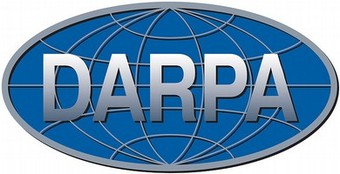

### What does DeepDive do?

DeepDive is a system to extract value from [dark data](http://www.gartner.com/it-glossary/dark-data).
Like dark matter, dark data is the great mass of data buried in text, tables, figures, and images, which lacks structure and so is essentially unprocessable by existing software.
DeepDive helps bring dark data to light by creating structured data (SQL tables) from unstructured information (text documents) and integrating such data with an existing structured database.
DeepDive is used to extract sophisticated relationships between entities and make inferences about facts involving those entities.
DeepDive helps one process a wide variety of dark data and put the results into a database.
With the data in a database, one can use a variety of standard tools that consume structured data; e.g., visualization tools like Tablaeu or analytics tools like Excel.

### What is DeepDive?

DeepDive is a new type of data management system that enables one to tackle extraction, integration, and prediction problems in a single system, which allows users to rapidly construct sophisticated end-to-end data pipelines, such as dark data BI (Business Intelligence) systems.
By allowing users to build their system end-to-end, DeepDive allows users to focus on the portion of their system that most directly improves the quality of their application.
By contrast, previous pipeline-based systems require developers to build extractors, integration code, and other components&mdash;without any clear idea of how their changes improve the quality of their data product.
This simple insight is the key to how DeepDive systems produce higher quality data in less time.
DeepDive-based systems are used by users without machine learning expertise in a number of domains from paleobiology to genomics to human trafficking; see our [showcase](showcase/apps.md) for examples.

DeepDive is a **trained system** that uses machine learning to cope with various forms of noise and imprecision.
DeepDive is designed to make it easy for users to train the system through low-level feedback via the [Mindtagger interface](labeling.md) and rich, structured domain knowledge via rules.
DeepDive wants to enable experts who do not have machine learning expertise.
One of DeepDive's key technical innovations is the ability to solve statistical inference problems at massive scale.

DeepDive differs from traditional systems in several ways:

- DeepDive asks the developer to **think about features—not algorithms**.
  In contrast, other machine learning systems require the developer think about which clustering algorithm, which classification algorithm, etc. to use.
  In DeepDive's joint inference based approach, the user only specifies the necessary **signals or features**.

- DeepDive systems can achieve high quality:
  PaleoDeepDive has **higher quality than human volunteers** in extracting complex knowledge in [scientific domains](http://www.plosone.org/article/info:doi/10.1371/journal.pone.0113523) and **winning performance** in [entity relation extraction competitions](http://i.stanford.edu/hazy/papers/2014kbp-systemdescription.pdf).

- DeepDive is aware that **data is often noisy and imprecise**: names are misspelled, natural language is ambiguous, and humans make mistakes.
  Taking such imprecision into account, DeepDive computes [calibrated](calibration.md) probabilities for every assertion it makes.
  For example, if DeepDive produces a fact with probability 0.9, the fact is 90% likely to be true.

- DeepDive is able to use large amounts of data from a **variety of sources**.
  Applications built using DeepDive have extracted data from millions of documents, web pages, PDFs, tables, and figures.

- DeepDive allows developers to **use their knowledge of a given domain** to improve the quality of the results by [writing simple rules](writing-model-ddlog.md) that inform the inference (learning) process.
  DeepDive can also take into account user feedback on the correctness of the predictions to improve the predictions.

- DeepDive is able to use the data to [learn "distantly"](distant_supervision.md).
  In contrast, most machine learning systems require tedious training for each prediction.
  In fact, many DeepDive applications, especially in early stages, need no traditional training data at all!

- DeepDive's secret is a **scalable, high-performance inference and learning engine**.
  For the past few years, we have been working to make the underlying algorithms run as fast as possible.
  The techniques pioneered in this project are part of commercial and open source tools including [MADlib](http://madlib.net/), [Impala](http://www.cloudera.com/content/cloudera/en/products-and-services/cdh/impala.html), a product from [Oracle](https://blogs.oracle.com/R/entry/low_rank_matrix_factorization_in), and low-level techniques, such as [Hogwild!](http://i.stanford.edu/hazy/papers/hogwild-nips.pdf).
  They have also been included in [Microsoft's Adam](http://www.wired.com/2014/07/microsoft-adam/) and other major web companies.

For more details, check out [our papers](papers.md).

### What is DeepDive used for?

Examples of DeepDive applications are described in our [showcase page](showcase/apps.md).

- [MEMEX](showcase/apps.md#memex) - Supporting the fight against human trafficking, which was recently featured on [Forbes](http://www.forbes.com/sites/thomasbrewster/2015/04/17/darpa-nasa-and-partners-show-off-memex/) and is now actively used by [law enforcement agencies](http://humantraffickingcenter.org/posts-by-htc-associates/memex-helps-find-human-trafficking-cases-online/).

- [PaleoDeepDive](https://www.youtube.com/watch?v=Cj2-dQ2nwoY) - A knowledge base for Paleobiologists with quality higher than human volunteers.

- [GeoDeepDive](https://www.youtube.com/watch?v=X8uhs28O3eA) - Extracting dark data from geology journal articles.

- [Wisci](https://www.youtube.com/watch?v=Q1IpE9_pBu4) - Enriching Wikipedia with structured data.

These examples are described in the [showcase page](showcase/apps.md).
The complete code for these examples is available with DeepDive (where permitted).
DeepDive is currently used in other domains with even more collaborators.
Stay tuned, and [get in touch with us](mailto:deepdive-dev@googlegroups.com) to talk about interesting projects.

### Who should use DeepDive?

Users should be familiar with DDlog or SQL, working with relational databases, and Python to build DeepDive applications or to integrate DeepDive with other tools.
A developer who wants to modify and improve DeepDive must have basic background knowledge mentioned in the [DeepDive developer's guide](developer.md#deepdive-code).

### Who develops DeepDive?

DeepDive is project led by [Christopher Ré](http://cs.stanford.edu/people/chrismre/) at Stanford University.
Current group members include:
[Michael Cafarella](http://web.eecs.umich.edu/~michjc/),
Xiao Cheng,
[Raphael Hoffman](http://raphaelhoffmann.com/),
Dan Iter,
Thomas Palomares,
Alex Ratner,
Theodoros Rekatsinas,
[Zifei Shan](http://www.zifeishan.org/),
[Jaeho Shin](http://cs.stanford.edu/~netj/),
Feiran Wang,
[Sen Wu](http://stanford.edu/~senwu/),
and
[Ce Zhang](http://pages.cs.wisc.edu/~czhang/).

###  Documentation

#### Getting Started

- [Quick Start](quickstart.md)
- [Tutorial: Extracting mentions of spouses from the news](example-spouse.md)

#### Background Reading

- [Relation extraction](relation_extraction.md)
- [Probabilistic inference and factor graphs](inference.md)
- [Distant supervision](distant_supervision.md)
- [DeepDive system overview and terminologies](overview.md)
- [Knowledge base construction](kbc.md)

#### DeepDive Application Development
- [How DeepDive applications are typically developed](development-cycle.md)
- [What a DeepDive application looks like](deepdiveapp.md)
- Writing a DeepDive Application
    - [Defining data flow in DDlog](writing-dataflow-ddlog.md)
    - [Writing user-defined functions in Python](writing-udf-python.md)
    - [Specifying a statistical model in DDlog](writing-model-ddlog.md)
- Running a DeepDive Application
    - [Compiling a DeepDive application](ops-compiling.md)
    - [Managing input data and data products](ops-data.md)
    - [Controlling execution of data processing](ops-execution.md)
    - [Learning and inference with the statistical model](ops-model.md)
- Debugging a DeepDive Application
    - [Debugging user-defined functions](debugging-udf.md)
    - [Calibration](calibration.md)
    - [Browsing DeepDive data with Mindbender](browsing.md)
    - [Labeling DeepDive data with Mindtagger](labeling.md)
    - [Monitoring statistics of DeepDive data with Dashboard](dashboard.md)
    - [Generating negative examples](generating_negative_examples.md)

#### Examples

<!-- Serious/End-to-end Examples -->
- [Extracting mentions of spouses from the news](example-spouse.md)

<!--
- [Table extraction](example-table.md) NEW
     <todo>If possible?</todo>
- [Image classification supervised by text](example-fusion_text_image_labels.md) NEW
     <todo>If possible?</todo>
- <todo>OCR example?</todo>
- <todo>What other good examples can we quickly polish and put here?</todo>
-->

<!-- Toy Examples -->
- [Cancer/Smoke/Friends: a classical toy example for MLNs](example-smoke.md)
- [Text chunking with Multinomial](example-chunking.md)

#### Advanced topics

- [FAQ](faq.md)
- Using DeepDive in Various Configurations
    - [Using DeepDive with GreenPlum](using-greenplum.md)
    - [Using DeepDive with Postgres-XL](using-pgxl.md)
    - [Using DeepDive on Amazon EC2](using-ec2.md)
- Using DeepDive with Various Compute Clusters
    - [Using DeepDive with the Torque scheduler](using-torque.md)
- References
    - [`deepdive.conf` Reference](configuration.md)
    - [Generic features library](gen_feats.md)
    - [High-speed sampler](sampler.md)
    - [Factor graph grounding output reference](factor_graph_schema.md)
    - [Internal database schema](reserved_tables.md)
- [DeepDive Developer's Guide](developer.md)

### Updates / Changelog

- [Changelog for version 0.8.0-alpha](changelog/0.8.0-alpha.md) (02/18/2016)
- [Changelog for version 0.7.1-alpha](changelog/0.7.1-alpha.md) (09/28/2015)
- [Changelog for version 0.7.0-alpha](changelog/0.7.0-alpha.md) (07/14/2015)
- [Changelog for version 0.6.0-alpha](changelog/0.6.0-alpha.md) (06/17/2015)
- [Changelog for version 0.05-alpha](changelog/0.05.01-alpha.md) (02/08/2015)
- [Changelog for version 0.04.2-alpha](changelog/0.04.2-alpha.md) (12/23/2014)
- [Changelog for version 0.04.1-alpha](changelog/0.04.1-alpha.md) (11/25/2014)
- [Changelog for version 0.04-alpha](changelog/0.04-alpha.md) (11/19/2014)
- [Changelog for version 0.03.2-alpha](changelog/0.03.2-alpha.md) (09/16/2014)
- [Changelog for version 0.03.1-alpha](changelog/0.03.1-alpha.md) (08/15/2014)
- [Changelog for version 0.03-alpha](changelog/0.03-alpha.md) (05/07/2014)
- [Changelog for version 0.02-alpha](changelog/0.02-alpha.md) (03/12/2014)

### Acknowledgment

We gratefully acknowledge the support of
the Defense Advanced Research Projects Agency (DARPA) XDATA Program under No. FA8750-12-2-0335
and DEFT Program under No. FA8750-13-2-0039,
DARPA's MEMEX program,
the National Science Foundation (NSF) CAREER Award under No. IIS-1353606
and EarthCube Award under No. ACI-1343760,
the Sloan Research Fellowship,
the Office of Naval Research (ONR) under awards No. N000141210041 and No. N000141310129,
the Moore Foundation,
American Family Insurance,
CHTC,
Google,
Lightspeed Ventures,
and Toshiba.
Any opinions, findings, and conclusions or recommendations expressed in this material are those of the authors and do not necessarily reflect the views of DARPA, AFRL, NSF, ONR, or the U.S. government.

  
  
  
  
  
  
  
  
  
  

