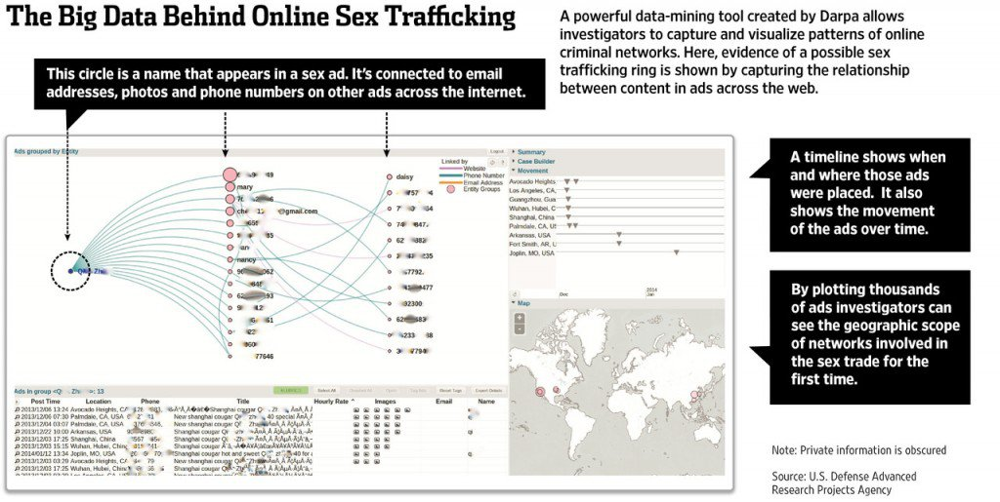
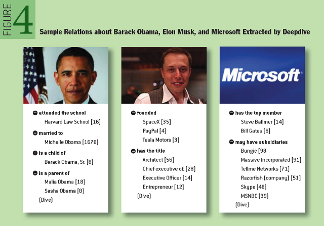
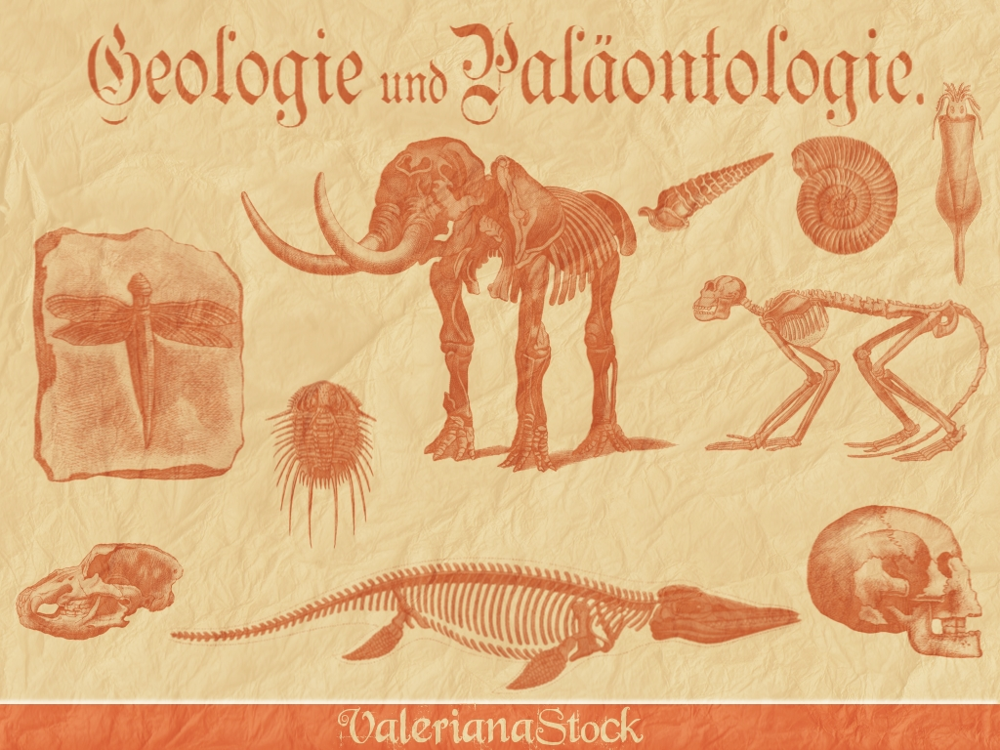
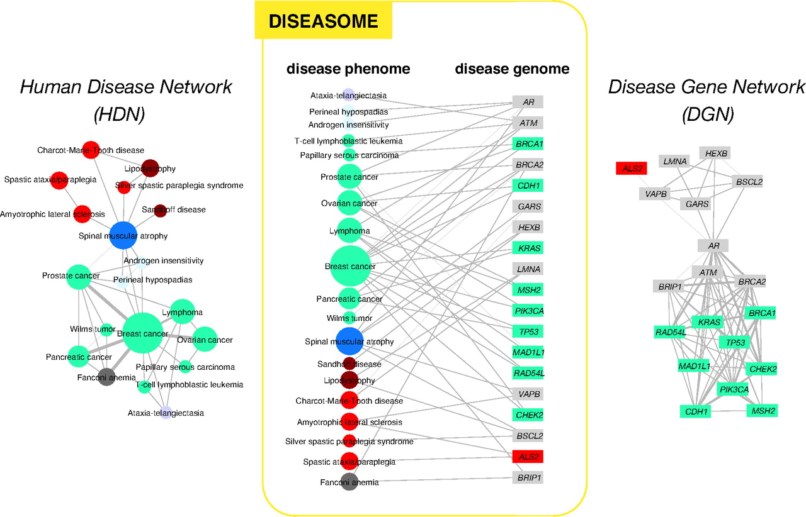
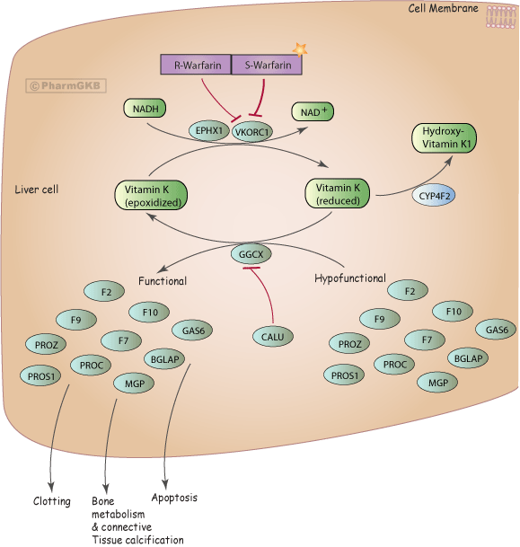

# DeepDive Applications

Here are a list of notable public DeepDive applications.

* [MEMEX / Human trafficking](#memex)
* [TAC-KBP Challenge](#tac-kbp)
* [Wisci(-pedia)](#wisci)
* [Geology and Paleontology](#geo-paleo)
* [Medical Genetics](#genetics)
* [Pharmacogenomics](#pharmacogenomics)

## MEMEX / Human trafficking

[MEMEX](http://www.darpa.mil/news-events/2014-02-09) is a DARPA program that explores how next generation search and extraction systems can help with real-world use cases.
The initial application is the [fight against human trafficking](http://www.cbsnews.com/news/new-search-engine-exposes-the-dark-web/).
In this application, the input is a portion of the public and dark web in which human traffickers are likely to (surreptitiously) post supply and demand information about illegal labor, sex workers, and more.
DeepDive processes such documents to extract evidential data, such as names, addresses, phone numbers, job types, job requirements, information about rates of service, etc.
Some of these data items are difficult for trained human annotators to accurately extract and have never been previously available, but DeepDive-based systems have high accuracy (Precision and Recall in the 90s, which may exceed non-experts).
Together with provenance information, such structured, evidential data are then passed on to both other collaborators on the MEMEX program as well as law enforcement for analysis and consumption in operational applications.
MEMEX has been [featured](http://www.scientificamerican.com/article/human-traffickers-caught-on-hidden-internet/) [extensively](http://www.wsj.com/articles/sleuthing-search-engine-even-better-than-google-1423703464) [in](http://www.wired.com/2015/02/darpa-memex-dark-web/) [the](http://www.bbc.com/news/technology-31808104) [media](http://www.defenseone.com/technology/2015/02/darpas-new-search-engine-puts-google-dust/105342) and is supporting [actual investigations](http://humantraffickingcenter.org/posts-by-htc-associates/memex-helps-find-human-trafficking-cases-online/).
For example, every human trafficking investigation pursued by the Human Trafficking Response Unity in New York City [involves MEMEX](http://humantraffickingcenter.org/posts-by-htc-associates/memex-helps-find-human-trafficking-cases-online/).
DeepDive is the [main extracted data provider](http://www.forbes.com/sites/thomasbrewster/2015/04/17/darpa-nasa-and-partners-show-off-memex/) for MEMEX.  See also, [60 minutes](http://www.cbsnews.com/news/new-search-engine-exposes-the-dark-web/), [Scientific American](http://www.scientificamerican.com/article/human-traffickers-caught-on-hidden-internet/), [Wall St. Journal](http://www.wsj.com/articles/sleuthing-search-engine-even-better-than-google-1423703464), [BBC](http://www.bbc.com/news/technology-31808104), and [Wired](http://www.wired.com/2015/02/darpa-memex-dark-web/). It is supporting actual [investigations](http://www.defenseone.com/technology/2015/02/darpas-new-search-engine-puts-google-dust/105342) and perhaps new usecases in the war on [terror](http://www.cnn.com/2015/05/12/politics/pentagon-isis-dark-web-google-internet/index.html).

Here is a detailed description of [DeepDive's role in MEMEX](memex.md).

## TAC-KBP Challenge
TAC-KBP (Text Analysis Conference, Knowledge Base Population track, organized by NIST) is a research competition where the task is to extract common properties of people and organizations (e.g., age, birthplace, spouses, and shareholders) from a few million of newswire and web documents -- this task is also termed [Slot Filling](http://surdeanu.info/kbp2014/KBP2014_TaskDefinition_EnglishSlotFilling_1.1.pdf).
In the 2014 evaluation, 31 US and international teams participated in the competition, including [a solution based on DeepDive](http://i.stanford.edu/hazy/papers/2014kbp-systemdescription.pdf) from Stanford.
The DeepDive based solution achieved **the highest precision, recall, and F1** among all submissions.
(See Table 6 in [Mihai Surdeanu and Heng Ji. *Overview of the English Slot Filling Track at the TAC2014 Knowledge Base Population Evaluation.* Proceedings of the TAC-KBP 2014 Workshop, 2014.](http://nlp.cs.rpi.edu/paper/sf2014overview.pdf))

## Wisci(-pedia)
Wisci is a first incarnation of the &ldquo;[encyclopedia built by the machines, for the people](https://www.youtube.com/watch?v=Q1IpE9_pBu4)&rdquo; vision.
(It was developed by the Hazy research group when the team was at University of Wisconsin-Madison. Hence the project name.)
We applied similar techniques as our solution to the TAC-KBP challenge -- namely [NLP, distant supervision, and probabilistic inference](http://www.cs.stanford.edu/people/chrismre/papers/deepdive_vlds.pdf) -- over the ClueWeb09 corpus that contains 500 million web pages.
The extraction and inference results include millions of common properties of people and organizations, as well as confidence scores and provenance.
They are used to augment a Wikipedia mirror, where we supplement human-authored page content and infoboxes with related facts, references, excerpts, and videos discovered by DeepDive.
Wisci also accepts user feedback and learns from it.

## Geology and Paleontology
[Geology](http://en.wikipedia.org/wiki/Geology) studies history of the solid Earth; [paleontology](http://en.wikipedia.org/wiki/Paleontology) studies fossils and ancient organisms. At the core of both disciplines are discovery and knowledge sharing. In particular, the research communities have maintained two live databases: [Macrostrat](https://macrostrat.org/#about), which contains tens of thousands of rock units and their attributes, and the [Paleobiology Database](https://paleobiodb.org/#/) (PBDB), which contains hundreds of thousands of taxonomic names and their attributes. However, both projects require researchers to laboriously sift through massive amounts of scientific publications, find relevant statements, and manually enter them into the database. For example, PBDB has taken approximately nine continuous person years to read from roughly 40K documents in the past two decades.
In collaboration with [Prof. Shanan Peters](http://geoscience.wisc.edu/geoscience/people/faculty/shanan-peters/) at UW-Madison, we developed two DeepDive programs, [GeoDeepDive](http://www.cs.stanford.edu/people/chrismre/papers/gdd_demo.pdf) and [PaleoDeepDive](http://journals.plos.org/plosone/article?id=10.1371/journal.pone.0113523), that process roughly 300K scientific documents (including text, tables, and figures). On the document set covered by both DeepDive and PBDB contributors (12K), DeepDive achieves recall roughly 2.5X that of humans, and precision that is as high as or higher than humans.

## Medical Genetics
The body of literature in life sciences has been [growing at accelerating speeds](http://www.nlm.nih.gov/bsd/index_stats_comp.html) to the extent that it has been unrealistic for scientists to perform research solely based on reading and memorization (even with the help of keyword search).
As a result, there have been numerous initiatives to build structured knowledge bases from literature.
For example, [OMIM](http://omim.org/) is an authoritative database of human genes and genetic disorders.
It dates back to the 1960s, and so far contains about 6,000 hereditary diseases or phenotypes.
Because OMIM is curated by humans, it has been growing at a rate of [roughly 50 records / month for many years](http://omim.org/statistics/update).
In collaboration with [Prof.
Gill Bejerano](http://bejerano.stanford.edu/pi.html) at Stanford, we are developing DeepDive applications in the field of [medical genetics](http://en.wikipedia.org/wiki/Medical_genetics).
Specifically, we use DeepDive to extract mentions of genes, diseases, and phenotypes from the literature, and statistically infer their relationships.

## Pharmacogenomics
Understanding the interactions of small chemicals or drugs in the body is key for drug discovery.
However, the majority of this data resides in the biomedical literature and cannot be easily accessed.
The Pharmacogenomics Knowledgebase (PharmGKB, [www.pharmgkb.org](http://www.pharmgkb.org)) is a high quality database that aims to annotate the relationships between drugs, genes, diseases, genetic variation, and pathways in the literature.
With the exponential growth of the literature, manual curation requires prioritization of specific drugs or genes in order to stay up to date with current research.
In collaboration with [Emily Mallory](http://bmi.stanford.edu/people-directory/current-students.html#fourthyear) (PhD candidate in the Biomedical Informatics training program) and Prof. Russ Altman at Stanford, we are developing DeepDive applications in the field of pharmacogenomics.
Specifically, we use DeepDive to extract relations between genes, diseases, and drugs in order to predict novel pharmacological relationships.

<figure>

<figcaption><small>

  M. Whirl-Carrillo, E.M. McDonagh, J. M. Hebert, L. Gong, K. Sangkuhl, C.F. Thorn, R.B. Altman and T.E. Klein.
  "<a href="http://www.ncbi.nlm.nih.gov/pubmed/22992668">Pharmacogenomics Knowledge for Personalized Medicine</a>"
  <i>Clinical Pharmacology &amp; Therapeutics (2012) 92(4): 414-417.</i>

    Copyright PharmGKB. Permission has been given by PharmGKB and Stanford University.

</small></figcaption>
</figure>

